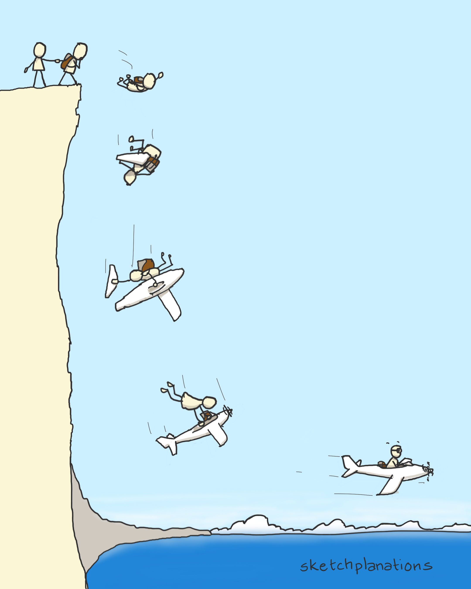

`As of 2025`: I work at the Centre for Consciousness Studies, NIMHANS, Bengaluru, India. I am wrapping up couple of research papers from my previous work and exploring broader frameworks to study Consciousness. At this point in time, I am diving deep into Buddhist philosophy of mind and Consciousness and some esoteric practices within some traditions of Vajrayana Buddhism. After attending the **Non-ordinary states of Consciousness** winter school and discussions with Prof Metzinger, I am drawn to the *Minimal Phenomenal Experience* project.

In a parallel dimension, I am building **uMaster** an initiative to solve everything weird and ugly with the current academia-research setup and higher education. Ah, by the way, I am a teacher at heart and really care a lot about the whole mentoring process. Partly, mentoring gives me lots of purpose in life points. I have taught schoolchildren and coached underprivileged people to get jobs; I have also worked as a career counselor, placement officer, and science lead for an early-stage education startup.

