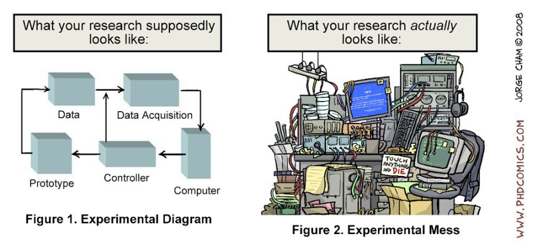

# Purpose
Scientific research is a collaborative effort and it is a journey through unknown. This guidebook is a glimpse to how Centre for Consciousness Studies (CCS) navigates. This is also a starting point for a positive mentor-mentee-lab experience

# Internship seekers, assemble
- Go through our *not so up to date* [website](https://ccsnimhans.netlify.app/)
- Get in touch with ex-interns or current graduate students to know better about the lab
- Tell us at least about one of our published work
- Do you have an area of interest or a project idea?
- What are the skillsets you already have?
- Do send us your CV at `ccsnimhans2020@gmail.com`
- We are going to ask you about each word in the CV

# Some things we really appreciate
- Self learning and `The Pursuit of Happyness` attitude
- You already taught yourself some skills which are valuable for the lab
- Design a poster, creative ideas, etc etc
- Picked up basics of the topics. Eg: Fundamentals of EEG, How to design experiments. Anything which is available in internet which can be self learned
- Read three major review papers in the topic you wanted to work
- Basics of statistics. You can run a small correlation analysis and interpret the findings
- Basic data visualisation skills
- Basic writing skills to communicate ideas
- Updated with current status if the research topic

# How not to be a supervisor and become a mentor
- [Read](https://oro.open.ac.uk/100811/) `Doctoral Supervision Guide` published by The Open University

# List of research topics at CCS
> Meditation | Sleep | Dreaming | Cognition | Neuromodulation | Metacognition | Heart-Brain interactions | Emotion-Cognition | Interoception | Phenomenology | Novel paradigm design | Dreaming | Wearables | Consciousness off course

# Formalities of the internship
Internship application can be found [here](https://training.nimhans.ac.in/Training/index.jsp). Talk to your mentor for further details.

# Expectations and Responsibilities
- Hard-work, patience and dedication are an unbeatable combo
- Don't apply for an internship with CCS if you aim to fill your CV. Currently, we don't take interns for less than 3 months duration
- You can't rush your work. Don't expect us to mentor you on some topic so that you can get a publication in 4 months
- We work with topics at the boundary of knowledge. We do triple checks, run peer reviews within the lab, openly discuss and share ideas within the lab, self learning, iterate, iterate and iterate

- Don't copy paste, cite your references, do not rely on pop science blogs or wikipedia (most of the times) as your source of knowledge
- Be nice, be respectful
- Respect the lab culture and provide constructive inputs
- Work at the edge of your abilities
- Build your self learn and critical thinking muscles
- Learn generously
- You shouldn't act surprised when people say they don't know something
- We do not tolerate subtle racism, sexism, homophobia, transphobia, and other kinds of bias
- Commit your time. We do not encourage working on side jobs, preparing for graduate applications, parallel internship juggles etc.
- We do understand that the above are priorities, but make sure you apply during a time when you are done with above or shift those outside your committed time

 > You are here because we want you to be here and believe in you. Own your work and show up
 
# Checks and ground rules
- Do not engage in controversial discussions (outside science) within the lab premises
- If there is any tension or hostility in the lab, something has to be done about it
immediately. We can’t thrive in an environment we aren’t comfortable in, and disrespect or rudeness will not be tolerated in the lab. Inform your mentor or co-mentor or Centre head if things spiral in awkward direction. Do not hesitate or wait longer
- Plan your leaves and inform in the chat group about your absence
- You are not expected to come into lab on Sundays and holidays, and you are not expected to stay late at night. However, if you wish so, coordinate with the `key` person
- Be on time. It is painful to work with people who don't show up on time
- Show up to meetings, seminars and other academic events

# Pointers
- Discuss your `internship work` thoroughly with your mentor
- Set your expectations right and we appreciate periodic followups and progress tracking
- Do not hesitate to ask and clarify. Please never assume
- Learning to present your research is important. Take initiative to present your work multiple times at respective check points
- We do care for your well-being, career development and the time you invest in `our` lab
- Do let us know in advance (two weeks at least) if you need recommendation letters and the nature of the same

# Code of conduct
- Unless otherwise stated, everybody is on a first name basis
- No sir and madam (the feudalistic habits don't encourage free science)
- Lewd language and behavior have no place in the lab

# Disclaimer
The views and opinions expressed in this blog post are solely my own and do not reflect an official stance.