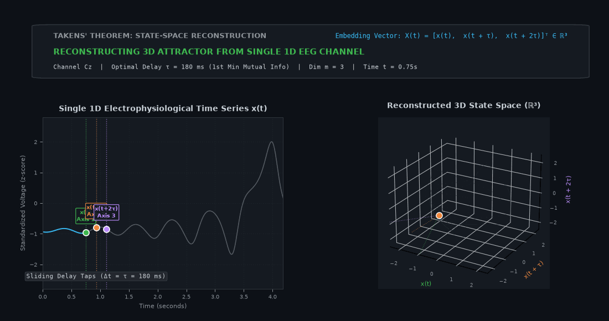
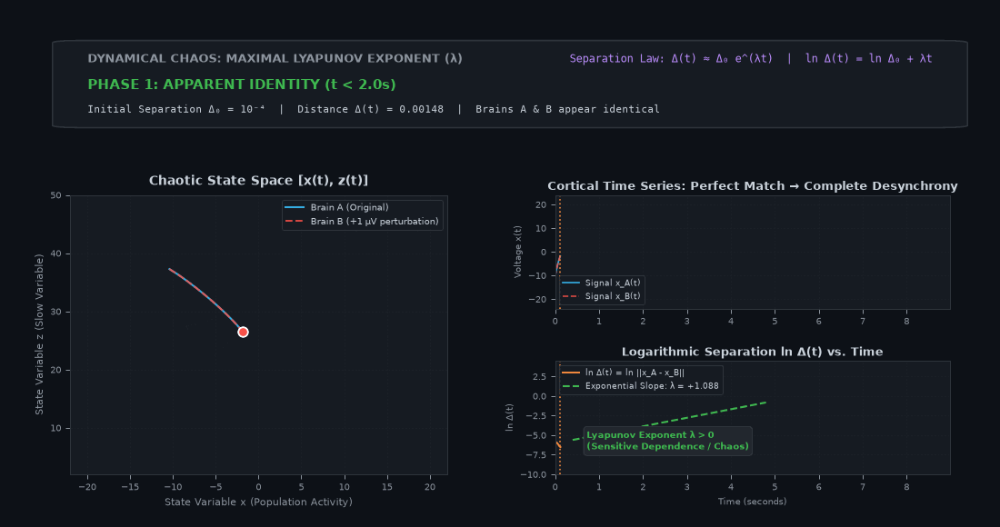
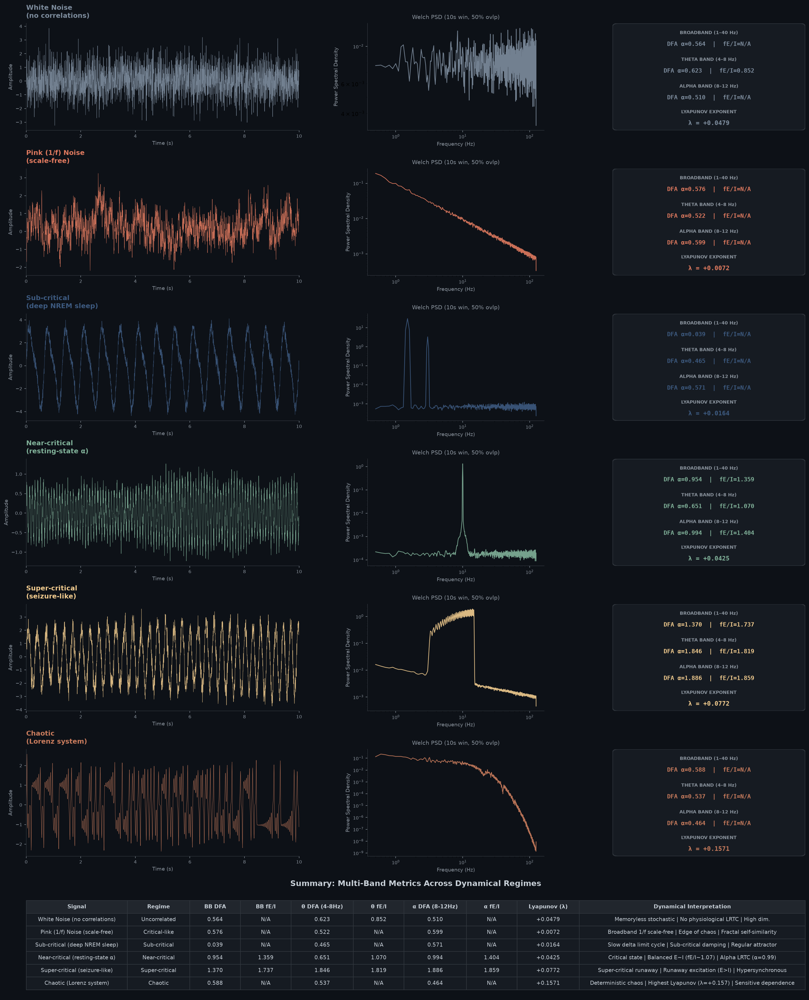

## 1. The Pattern Hiding Inside Every EEG Trace

We have recorded a clean 64-channel EEG. Now we stare at those wiggly lines
and ask: **What kind of system produced this?**

<!--more-->

Over the next several sections we will build, brick by brick, the vocabulary and intuition we need to engage with several foundational ideas:

1. **Dynamical systems & state space** — the language and geometry for mapping how brain states evolve over time.
2. **Bifurcations & tipping points** — how continuous biological parameter shifts (like sleep pressure or neuromodulation) abruptly flip the brain's dynamical landscape, giving birth to oscillations (Hopf)
or triggering sudden state transitions (saddle-node/fold).
3. **Chaos: sensitive dependence, not randomness** — why deterministic unpredictability is a cognitive feature, not a bug.
4. **Scale-free dynamics** — the power-law fingerprint that critical natural systems leave in their fluctuations.
5. **Detrended Fluctuation Analysis (DFA)** — reading long-range temporal correlations from neural time series.
6. **The functional Excitation/Inhibition ratio (fE/I)** — a sharper lens on the critical balance of variance accumulation.
7. **Lyapunov exponents** — quantifying sensitivity to tiny perturbations and diagnosing the edge of chaos.
8. **Broadband vs. Narrowband dynamics** — why critical dynamics are rhythm-specific and where long-range temporal correlations truly live.
9. **Criticality & bifurcations across brain states** — how the operating point moves from quiet wakefulness to task engagement, sleep, anesthesia, and seizures.
10. **Empirical 1D Time-Series Benchmark** — hands-on testing of these metrics across 6 neurodynamical regimes with smooth Welch power spectra.

---

## 2. What Is a Dynamical System? (We Already Know One)

### 2.1 The Pendulum on Our Desk

Imagine a desk pendulum — the kind with a steel ball on a string. Pull it to one side, let go. It swings back and forth, gradually slowing down because of air resistance. That pendulum is a **dynamical system** a thing whose *state* changes over time according to some rule.

- **State** the position and velocity of the ball at any instant.
- **Rule** gravity pulls it back toward the centre; friction bleeds away energy.

If we know the state right now, and we know the rule, we can (in principle) predict the state one second from now. That's what "dynamical" means — there is a law of motion, and the system obeys it.

### 2.2 The Brain as a Dynamical System

Our brain is also a dynamical system, just a horrifyingly complicated one. The "state" is the pattern of membrane potentials, synaptic conductances, and neurotransmitter concentrations across ~86 billion neurons (timebeing let's ignore glia and other such things inside the cranial vault). The "rules" are ion-channel biophysics, synaptic transmission, network connectivity, and so on.

We never observe the full state. EEG gives us a *shadow* of it — a low-dimensional, spatially smeared, temporally filtered projection. But the shadow still carries information about what kind of dynamical system cast it. That's the key insight that makes everything below worthwhile.

### 2.3 State Space A Map of All Possibilities

If there is one concept in dynamical systems that routinely trips up neuroscientists, it is **state space** (also called **phase space**). Let's demystify it completely.

#### 2.3.1 Crucial Mental Shift State Space Is NOT Physical Space!

When neuroscientists hear the word "space," we naturally visualize 3D anatomical coordinates inside the head:
- *"The hippocampus is at (x = -24, y = -18, z = -16) mm in MNI space."*

**State space has nothing to do with physical anatomy or millimeters inside the skull.**

In state space:
- Every **axis** represents a **variable of interest** that describes the system.
- A **single point** (a set of coordinates) represents the **complete state of the entire system at one exact instant in time**.
- As time advances, the system changes, meaning the numbers change. The point moves.
- The path that the moving point traces through this space over seconds, minutes, or hours is called the **trajectory**.

Think of state space as a **complete geometric map of everything the system could ever possibly do**.

#### 2.3.2 Two Intuitive Pointers to Get a Firm Grip

##### Pointer 1: The ICU Bedside Monitor (The Clinical Analogy)
Imagine we are monitoring a critically ill patient in an intensive care unit. We track three vital signs:
1. **Heart Rate (*HR*, bpm)**
2. **Mean Arterial Blood Pressure (*BP*, mmHg)**
3. **Core Body Temperature (*T*, °C)**

Let each vital sign be one axis of a 3D coordinate frame: *X* = *HR*, *Y* = *BP*, *Z* = *T*.

- At 2:00 PM, the patient's vitals are (72 bpm, 90 mmHg, 37.0°C). That is **one single dot** in this 3D state space.
- At 2:05 PM, the patient is startled by an alarm: vitals shift to (98, 115, 37.0). The dot moves to a new location.
- Over 24 hours, the dot weaves a continuous winding path (a trajectory).
- If the patient is healthy and resting, the dot orbits within a tight, predictable physiological envelope (homeostasis).
- If the patient goes into septic shock, blood pressure plummets while heart rate and temperature spike—the dot veers wildly off into an aberrant, life-threatening corner of the space.

Notice what happened: we took three separate time series from three monitors and turned them into **one unified geometric dance**. That is state space.

##### Pointer 2: The Pendulum (Position × Velocity)
Why can't we just plot position? If a pendulum ball is at the center position ($x = 0$), where will it be half a second from now? We have no idea unless we know whether it is swinging left, swinging right, or standing dead still! 

To know where the system is going, we must know both its **configuration** ($x$) and its **momentum / velocity** ($v$). For a simple pendulum, the state space is a 2D plane:
$$\text{State } \mathbf{s}(t) = [x(t),~ v(t)]$$
As the pendulum swings back and forth, the state $(x, v)$ traces a smooth oval loop around the origin. If friction slows it down, the oval spirals inward toward $(0, 0)$—a **fixed-point attractor**.

---

#### 2.3.3 What Could Be the State Space for EEG?

Now comes the million-dollar question for electrophysiologists: **The brain has 86 billion neurons and trillions of synapses. We obviously cannot track 86 billion axes. So what actually constitutes the state space in an EEG experiment?**

In electrophysiology, researchers define and reconstruct state spaces in **three distinct, highly practical ways**:

```
                       ┌──────────────────────────────────────────────┐
                       │           EEG STATE SPACE PARADIGMS          │
                       └──────────────────────┬───────────────────────┘
                                              │
         ┌────────────────────────────────────┼────────────────────────────────────┐
         │                                    │                                    │
         ▼                                    ▼                                    ▼
┌──────────────────┐               ┌──────────────────┐               ┌──────────────────┐
│ 1. SENSOR SPACE  │               │2. DELAY-EMBEDDING│               │3. FEATURE SPACE  │
│ Multi-channel    │               │ Single-channel   │               │ Dynamic sliding  │
│ Scalp Voltages   │               │ Takens' Theorem  │               │ Spectral metrics │
│ R^64 (Microstates│               │ R^m (Lyapunov /  │               │ (Sleep, Anesthesia│
│ & PCA orbits)    │               │ Attractor recon) │               │ Depth, Disease)  │
└──────────────────┘               └──────────────────┘               └──────────────────┘
```

##### 1. The Multi-Channel Sensor State Space (Voltage Space & EEG Microstates)
If we place a 64-channel EEG cap on a participant's head ($Fz, Cz, Pz, O1 \dots$), we are recording 64 simultaneous voltages every millisecond:
$$\mathbf{V}(t) = [V_{\text{Fz}}(t),~ V_{\text{Cz}}(t),~ V_{\text{Pz}}(t),~ \dots,~ V_{\text{O2}}(t)] \in \mathbb{R}^{64}$$

In this framework, **state space is a 64-dimensional space where each electrode is one axis**.
- At any single sample $t$ (say, $t = 12.450\text{ s}$), the entire scalp electrical field across the whole head is represented by **one single point** in this 64D space!
- As cortical assemblies synchronize and desynchronize, this point flies through the 64-dimensional volume.
- **Direct Connection to EEG Microstates:** When this 64D trajectory dwells inside a specific localized cluster for 80–120 ms before rapidly jumping to another cluster, those clusters are exactly the canonical **EEG Microstates (Classes A, B, C, D)**! Microstates are simply discrete "attractor basins" in 64-channel sensor state space.
- By applying Principal Component Analysis (PCA) or manifold learning (UMAP/t-SNE), we can project this 64D trajectory down to the top 2 or 3 principal axes ($PC_1$, $PC_2$, $PC_3$) and watch the brain's multi-channel state orbit in 3D.

##### 2. The Delay-Embedded State Space (Takens' Theorem on a Single 1D Trace)
*"What if we only recorded a single EEG channel, or we are analyzing one source-localized dipole in the auditory cortex? Can we still build a state space from a single 1D wiggly line?"*

Yes—and this is one of the most remarkable mathematical discoveries of 20th-century physics: **Takens' Embedding Theorem ([Takens, 1981](#ref-10))**.

Floris Takens proved that we can reconstruct the full multi-dimensional attractor of a complex system from a **single scalar time series $x(t)$** simply by creating pseudo-dimensions out of **time-delayed copies** of the signal:
$$\mathbf{X}(t) = [x(t),~ x(t + \tau),~ x(t + 2\tau),~ \dots,~ x(t + (m-1)\tau)] \in \mathbb{R}^m$$
where:
- $\tau$ is the **time delay** (e.g., 10 ms, often selected as the first minimum of the signal's mutual information or autocorrelation zero-crossing).
- $m$ is the **embedding dimension** (e.g., $m = 3$ to $10$, chosen via false nearest neighbors).

For an intuitive 3D visualization ($m = 3$):
- **Axis 1:** Voltage right now: $x(t)$
- **Axis 2:** Voltage a short time later: $x(t + \tau)$
- **Axis 3:** Voltage even further later: $x(t + 2\tau)$

**Why does this magic trick work?** Because cortical circuits are densely recurrent. The voltage recorded at electrode $Cz$ at this instant is not isolated; it was shaped by inputs from thalamic nuclei, inhibitory interneurons, and distant frontal regions that fired 10 ms and 20 ms ago. The delayed versions of $x(t)$ act as biological proxies for the "hidden" unmeasured variables of the network!

Takens mathematically proved that this reconstructed "shadow attractor" shares the exact same topological invariants (the same **Lyapunov exponents $\lambda$**, the same **fractal dimension**) as the true unobserved system. **This delay-embedded space is precisely what non-linear toolboxes like `nolds` use to compute the maximal Lyapunov exponent from a 1D EEG trace** (as demonstrated in Section 12).




**How Takens' Theorem reconstructs high-dimensional cortical dynamics:**
- **The 1D Problem (Left Panel):** A single EEG electrode (such as $Cz$) only records a scalar time series $x(t)$. At first glance, a 1D line looks messy and non-Markovian because the voltage at $t$ depends on countless unobserved recurrent loops across cortical columns, thalamic relay nuclei, and local interneurons.
- **The Sliding Delay Vector (The 3 Tap Dots):** By sampling the signal at three discrete delay taps $[x(t),~ x(t + \tau),~ x(t + 2\tau)]$ separated by an optimal delay $\tau \approx 180\text{ ms}$ (selected at the first minimum of mutual information), the delayed coordinates act as biological stand-ins for the unmeasured state variables!
- **Attractor Reconstruction (Right Panel):** As time advances, the 3D coordinate vector $\mathbf{X}(t) \in \mathbb{R}^3$ traces out the system's topological attractor. Takens (1981) proved that if the embedding dimension $m > 2 d_{\text{attractor}}$, this reconstructed geometry preserves the fundamental invariant properties of the real brain—including its **fractal dimension** and **maximal Lyapunov exponent ($\lambda$)**!


##### 3. The Feature / Spectral State Space (Macroscopic Brain States)
Instead of millisecond-by-millisecond voltages, electrophysiologists often define a state space whose axes are **continuous summary biomarkers** computed in sliding windows (e.g., every 2 seconds):
- **Axis 1:** Delta band power (Slow-Wave sleep / cortical down-state index)
- **Axis 2:** Alpha band power (Thalamocortical sensory gating / relaxed wakefulness)
- **Axis 3:** Broadband $1/f$ spectral slope $\chi$ (Global synaptic E/I conductance balance)

In this 3D feature state space:
- **Quiet wakefulness** lives in a high-alpha, moderate-slope territory.
- **Stage N3 slow-wave sleep** migrates to a massive-delta, low-alpha region.
- **General anesthesia induction** systematically drives the trajectory down a steep slope gradient toward metabolic depression.
- Tracking the trajectory over 8 hours gives a geometric map of an individual's sleep architecture or recovery from coma.

---

#### 2.3.4 What Are Attractors in EEG State Space?

Once we grasp that the axes are measurable variables, the concept of an **attractor** ceases to be abstract:

| Attractor Type | Geometric Shape in State Space | Electrophysiological EEG Counterpart | Underlying Neurobiology |
| :--- | :--- | :--- | :--- |
| **Fixed Point** | A single stationary dot | **Isoelectric EEG (Flatline)** | Deep hypothermic cardiac arrest, burst-suppression inter-bursts, or brain death. All time derivatives $\frac{dV}{dt} = 0$; the system is motionless. |
| **Limit Cycle** | A closed, repeating circular or oval loop | **Generalized Tonic-Clonic Seizure or Deep N3 Slow Waves** | Rigid, hypersynchronous pacemaking. Trajectories repeat the identical orbit with low entropy; the brain is stuck in a repetitive computational rut. |
| **Chaotic / Strange Attractor** | A bounded, intricately folded fractal ribbon that never self-intersects | **Healthy Resting Wakefulness (Alpha/Beta Dynamics)** | The trajectory never repeats the exact same path (infinite cognitive flexibility and memory capacity), yet remains bounded within stable limits. Poised at the edge of chaos ([Strogatz, 2015](#ref-11)). |


**State space is not physical anatomy inside the skull.** It is an abstract coordinate system where a single point represents the instantaneous configuration of the entire system, and its movement over time traces a trajectory through possibilities. In electrophysiology, this is realized via:
1. **Sensor Space ($\mathbb{R}^{64}$):** Multi-channel scalp voltage snapshots & microstate attractor basins.
2. **Delay-Embedding ($\mathbb{R}^m$):** Takens' reconstruction of the topological attractor from a single 1D electrode.
3. **Feature Space ($\mathbb{R}^k$):** Dynamic trajectory across sliding-window spectral and criticality biomarkers.


We now understand what state space is, and we have met the three classic attractors: fixed points, limit cycles, and strange attractors. But here is the critical question:
*What happens when the underlying biology slowly changes? What happens when a person becomes progressively sleepier, when an anesthetic is slowly infused, or when neuromodulatory acetylcholine surges during arousal?*

The attractors themselves do not stay frozen in stone. Valleys flatten, hills emerge, and stable paths can suddenly vanish into thin air.
That brings us directly to **bifurcations**.

---

## 3. Bifurcations: When the Landscape Flips Under Our Feet

### 3.1 What Is a Bifurcation? (The Tipping Point in the Landscape)

So far, we have imagined attractors as fixed, permanent valleys in state space: roll a marble, and it settles reliably into the bottom of the bowl.

In a living brain, however, **the bowl itself is malleable**. The physical shape of the state space landscape is dynamically sculpted by biological parameters:
- Synaptic excitation-to-inhibition (E/I) balance,
- Neuromodulators like acetylcholine, noradrenaline, and dopamine,
- Corticothalamic feedback gain,
- Homeostatic sleep pressure (adenosine accumulation).

As long as a parameter shifts slightly within a safe physiological envelope, the attractor deforms smoothly: the valley might shift a millimeter or become slightly shallower, but the marble stays comfortably trapped inside.

A **bifurcation** occurs when a continuous change in a control parameter reaches a critical threshold that **qualitatively alters the topological structure of state space**. Fixed points can appear, collide, split, lose stability, or vanish entirely. A single valley can split into two, or a stationary resting point can suddenly begin to oscillate.


A **bifurcation** is a qualitative change in the long-term dynamical behavior, stability, or geometric topology of a system's attractors as one or more control parameters cross a critical threshold. It is the deterministic dynamical systems counterpart of a **phase transition**.


---

### 3.2 The Two Essential Bifurcations Every Neuroscientist Must Know

Nonlinear dynamics contains a vast taxonomy of bifurcations ([Strogatz, 2015](#ref-11)), but for electrophysiologists, two fundamental forms govern the overwhelming majority of neural phenomena:

```
               ┌────────────────────────────────────────────────────────┐
               │         CANONICAL NEUROSCIENCE BIFURCATIONS            │
               └───────────────────────────┬────────────────────────────┘
                                           │
             ┌─────────────────────────────┴─────────────────────────────┐
             ▼                                                           ▼
┌───────────────────────────────┐               ┌────────────────────────────────┐
│      1. HOPF BIFURCATION      │               │ 2. SADDLE-NODE (FOLD) BIFURC.  │
│ Fixed Point <──> Limit Cycle  │               │ Equilibrium Collision & Drop   │
│ Emergence of Rhythms (Alpha)  │               │ Tipping Points & Hysteresis    │
│ (Wilson-Cowan, Whole-Brain)   │               │ (Seizures, Sleep Onset)        │
└───────────────────────────────┘               └────────────────────────────────┘
```

#### 1. The Hopf Bifurcation: The Genesis of Neural Oscillations

How does a silent, quiescent neuronal population suddenly burst into rhythmic oscillations? 

In mathematical terms, an equilibrium fixed point has eigenvalues $\lambda = \alpha \pm i\omega$ describing how perturbations decay or oscillate. If the real part $\alpha \lt 0$, any disturbance spirals inward to rest (a stable focus).

As we crank up a control parameter $\mu$ (for instance, background thalamic sensory drive or recurrent synaptic gain), the real part crosses zero:
$$\alpha(\mu_c) = 0, \quad \omega \neq 0$$

At this critical threshold $\mu_c$, the fixed point loses stability, and the spiraling trajectories expand outwards until they are captured by a stable, repeating closed orbit: a **limit cycle**. This is a **Hopf bifurcation**.

There are two primary flavors:
1. **Supercritical Hopf (Soft Onset):** The oscillation emerges continuously. Right past the bifurcation, the amplitude of the rhythm grows smoothly from zero in proportion to $\sqrt{\mu - \mu_c}$, without any abrupt jump or hysteresis.
2. **Subcritical Hopf (Hard Onset):** The system abruptly jumps from silence into a large-amplitude, runaway oscillation, often exhibiting bistability and hysteresis.

**Why electrophysiologists care:**
- **The Alpha Rhythm:** When a subject closes their eyes, thalamocortical loop gain crosses a supercritical Hopf bifurcation, transitioning the occipital cortex from asynchronous low-voltage activity into robust ~10 Hz alpha oscillations.
- **Whole-Brain Connectome Models:** In large-scale computational neuroscience (e.g., The Virtual Brain; [Deco et al., 2011](#ref-15); Breakspear, 2017), each cortical region is often modeled as a Stuart-Landau or Wilson-Cowan oscillator tuned **right to the edge of a supercritical Hopf bifurcation** ($\mu \approx 0$). At this exact operating point, regional nodes retain maximal sensitivity to incoming structural connectome signals without locking permanently into rigid, unresponsive rhythms.

 to Synchronized Limit Cycle Rhythms (Eyes Closed)")


The animation above visualizes the **Supercritical Hopf Bifurcation** in real time:
- **Left Panel (State Space Phase Portrait $[x, y]$):**
  - **Sub-critical ($\mu \lt 0$):** The origin $(0, 0)$ is a **stable focus** ($\text{Re}(\lambda) \lt 0$, solid green dot). Perturbations spiral inwards and damp out to baseline rest.
  - **Bifurcation Point ($\mu = 0$):** The critical boundary ($\text{Re}(\lambda) = 0$). The resting equilibrium loses stability.
  - **Super-critical ($\mu \gt 0$):** The origin flips into an **unstable focus** ($\text{Re}(\lambda) \gt 0$, open red circle). Trajectories spiral outwards until captured by the **stable limit cycle** of radius $r = \sqrt{\mu}$, orbiting steadily.
- **Right Panel (Simulated Scalp EEG Time Series $x(t)$):**
  - Demonstrates the classic **soft onset** of neural rhythms. In the eyes-open asynchronous regime ($\mu \lt 0$), voltage fluctuations decay rapidly.
  - As thalamocortical gain crosses $\mu = 0$ (e.g., closing the eyes), coherent ~10 Hz alpha oscillations bloom spontaneously, tracking an expanding amplitude envelope proportional to $\sqrt{\mu}$ without discontinuous jumps or hysteresis.


---

#### 2. The Saddle-Node (Fold) Bifurcation: Tipping Points, Bistability & Hysteresis

What happens when an entire brain state disappears?

Consider the canonical mathematical model of a fold bifurcation in a state variable $x$ driven by parameter $\mu$:
$$\frac{dx}{dt} = \mu - x^2$$

Setting $\frac{dx}{dt} = 0$ reveals the equilibria:
$$x^\ast = \pm \sqrt{\mu}$$

Let's trace what happens as $\mu$ decreases:
1. **When $\mu \gt 0$:** There are two equilibria: a **stable node** at $x^\ast = +\sqrt{\mu}$ (a protective valley where the system rests) and an **unstable saddle** at $x^\ast = -\sqrt{\mu}$ (the mountain peak separating this valley from the rest of the world).
2. **As $\mu \to 0$:** The mountain peak and the valley floor slide toward each other. The barrier gets shallower and narrower.
3. **At $\mu = 0$ (The Tipping Point):** The stable valley and the unstable barrier collide and annihilate each other!
4. **When $\mu \lt 0$:** There are **zero equilibria**. The valley has literally ceased to exist. 

```
   μ > 0 (Two States: Stable + Saddle)           μ < 0 (Post-Bifurcation: Tipping Point)

             Unstable Saddle                               No Equilibrium Points!
               (Threshold)                                 Trajectory drops rapidly...
                   /\
                  /  \     Stable Node                             \
                 /    \   (Waking Valley)                           \
                /      \     O                                       \
               /        \___/                                         \_________
```

The trajectory can no longer stay where it was. It has no choice but to plunge rapidly and irreversibly toward another distant attractor basin.

**The Crucial Consequence: Hysteresis**
Once the system tumbles off the cliff, nudging the parameter slightly back to $\mu = 0.01$ will **not** bring it back! The old valley was annihilated. To climb back to the original state, the parameter must be pushed far in the opposite direction until a second bifurcation creates an alternative return path.

This is the mathematical definition of **hysteresis**: the state of the brain depends not only on the current inputs, but on the history of how it arrived there. We see this daily in:
- **Epileptic Seizures:** The sudden explosive transition into an ictal seizure and the abrupt, delayed termination (seizure offset) follow fold/homoclinic bifurcations.
- **Anesthetic Induction vs. Emergence:** The concentration of propofol required to extinguish consciousness during induction is significantly higher than the concentration at which consciousness re-emerges during wake-up (a phenomenon known as **neural inertia**; Luppi et al., 2021).
- **The Wake-Sleep Transition:** Falling asleep is not a smooth, reversible rheostat.

 Bifurcation: Landscape Annihilation and Catastrophic Brain State Transitions")


The animation above captures the **Saddle-Node (Fold) Bifurcation** across five sequential stages:
- **Left Panel (Potential Energy Landscape $V(x)$ — The Malleable Bowl):**
  - **Stage 1 (Safe Waking Basin, $\mu \gt 0$):** The brain state (amber marble) rests at the stable waking node ($x^\ast = +\sqrt{\mu}$), shielded by the unstable saddle barrier ($x^\ast = -\sqrt{\mu}$).
  - **Stage 2 (Critical Slowing Down, $\mu \to 0^+$):** As sleep pressure or anesthesia builds, the valley flattens out ($\lambda = -2\sqrt{\mu} \to 0$). Internal synaptic perturbations cause wide oscillations (surging signal variance and autocorrelation).
  - **Stage 3 (Tipping Point, $\mu = 0$):** The saddle and node collide and annihilate each other into a flat inflection point. The waking attractor ceases to exist.
  - **Stage 4 (Catastrophic Plunge, $\mu \lt 0$):** With zero remaining equilibria in the waking zone, the brain state plunges rapidly down the steep slide into the deep alternative attractor basin (Slow-Wave Sleep Delta state or Seizure).
  - **Stage 5 (Hysteresis & Neural Inertia):** When $\mu$ is nudged back above zero, the waking well reforms, but the marble remains trapped in the deep sleep basin behind a high potential barrier. The brain cannot spontaneously return without a substantial reverse drive.
- **Right Panel (Bifurcation S-Curve & Cortical LFP/EEG Trace):**
  - Top subplot tracks the state moving along the fold curve: from the upper green branch ($x^\ast = +\sqrt{\mu}$), down the dashed red tipping plunge at $\mu = 0$, onto the lower blue sleep branch.
  - Bottom subplot displays the accompanying EEG: fast waking activity $\to$ Critical Slowing Down (swelling variance) $\to$ sharp, irreversible transition into high-amplitude slow-wave delta rhythms.


---

### 3.3 Critical Slowing Down (CSD): The Universal Early-Warning Siren

Here is where dynamical systems theory hands electrophysiologists a superpower.

Before a system reaches a fold or continuous bifurcation tipping point, **the curvature of its attractor valley flattens out**. 

Recall that the restoring force pulling a system back to equilibrium is governed by the derivative of the flow:
$$\lambda = \left.\frac{d}{dx}\left(\frac{dx}{dt}\right)\right|_{x^\ast}$$
For our fold model $\frac{dx}{dt} = \mu - x^2$, the stable equilibrium is $x^\ast = +\sqrt{\mu}$. Evaluating the slope:
$$\lambda = -2\sqrt{\mu}$$

As the control parameter approaches the tipping point ($\mu \to 0^+$), this restoring slope approaches zero:
$$\lambda \to 0^-$$

Because the restoring force weakens toward zero, any perturbation pushed by internal synaptic noise takes longer and longer to recover. The recovery time diverges toward infinity:
$$\tau_{\text{recovery}} = -\frac{1}{\lambda} \to \infty$$

This universal physical phenomenon is called **Critical Slowing Down (CSD)** ([Scheffer et al., 2012](#ref-14)).

```
        STEEP VALLEY (Far from Tipping Point)          FLAT VALLEY (Near Tipping Point: CSD)
        
                  \       /                                      \                   /
                   \  O  /                                        \        O        /
                    \___/                                          \_______________/
             Restoring force: STRONG                        Restoring force: WEAK
             Perturbations: Damped quickly                  Perturbations: Linger indefinitely
             Autocorrelation: LOW                           Autocorrelation: SURGES HIGH
             Variance: COMPACT                              Variance: EXPLODES BROADLY
```

In recorded electrophysiological time series, Critical Slowing Down leaves **two distinct, measurable fingerprints**:

1. **Autocorrelation Surges (Memory Lengthens):** Because the system takes much longer to return to baseline after a random synaptic fluctuation, the state at time $t$ becomes heavily dependent on its state at $t - \Delta t$. The lag-1 autocorrelation $r_1$ climbs toward 1.0, and the **DFA scaling exponent $\alpha$ increases** as long-range temporal correlations stretch out.
2. **Variance Explodes (Fluctuation Amplitude Balloons):** Because the walls of the attractor bowl are practically flat, ordinary baseline synaptic noise can shove the system much farther across state space. The variance $\sigma^2$ and power spectral amplitude of the signal swell dramatically.

Whenever we observe autocorrelation and variance simultaneously escalating in a physiological signal, the dynamical system is crying out: **a bifurcation tipping point is imminent!**

: Valley Flattening, Perturbation Lingering, and Early-Warning Surges in Variance and Autocorrelation")


**How CSD manifests mechanically and statistically across brain states:**
- **Mechanical Fluctuation (Left Panel):** Far from the tipping point (Stage 1), the attractor well $V(x)$ is steep. The restoring force $F = -kx$ is strong, snapping state perturbations back to equilibrium in milliseconds ($\tau \approx 0.3\text{ s}$). As the system approaches the bifurcation (Stage 3), the attractor floor flattens out ($k \to 0$). The restoring force vanishes, causing perturbations to linger indefinitely ($\tau \to \infty$) and ambient synaptic noise to shove the state marble across wide swings.
- **Electrophysiological Trace $x(t)$ (Top-Right):** In healthy stable states, cortical voltages fluctuate in a narrow band. Near the tipping point, the variance explodes—the signal balloons into sluggish, high-amplitude excursions as seen prior to epileptic seizures or sudden sleep onset.
- **The Early-Warning Dashboard (Bottom-Right):** By computing sliding-window **Variance ($\sigma^2$)** and **Lag-1 Autocorrelation ($r_1$)**, electrophysiologists can monitor the approaching catastrophe in real time. When both metrics climb past threshold, the system triggers the early-warning siren—proving that tipping points in the brain cast measurable physical shadows before they occur!


---

### 3.4 Landmark Discovery: Falling Asleep Follows a Predictable Bifurcation Dynamic

For nearly a century, clinical neurology and sleep medicine have classified the onset of sleep using the Rechtschaffen & Kales (R&K) and American Academy of Sleep Medicine (AASM) standards: breaking sleep into discrete 30-second epoch bins (**Wake $\to$ Stage N1 $\to$ Stage N2 $\to$ Stage N3**).

This created a fundamental conceptual paradox: **Does human consciousness actually switch off in discrete 30-second jumps, or does the brain slide down a continuous slope?**

A landmark study published in *Nature Neuroscience* by **Li, Ilina, Peach et al. (2025)** ([#ref-13](#ref-13)) answered this question decisively using the exact dynamical systems framework we have just developed.

```
       ┌────────────────────────────────────────────────────────────────────────┐
       │   LI ET AL. (2025) NATURE NEUROSCIENCE BIFURCATION SLEEP MODEL         │
       └───────────────────────────────────┬────────────────────────────────────┘
                                           │
         ┌─────────────────────────────────┴─────────────────────────────────┐
         ▼                                                                   ▼
┌─────────────────────────────────┐                 ┌─────────────────────────────────┐
│     CONTINUOUS STATE SPACE      │                 │     FOLD (SADDLE-NODE) BIFURC.  │
│ Multi-channel EEG projected     │                 │ Waking attractor basin flattens │
│ into normalized feature space   │                 │ as homeostatic sleepiness rises;│
│ (Spectral balance trajectories) │                 │ CSD triggers variance/AC surge. │
└────────────────┬────────────────┘                 └────────────────┬────────────────┘
                 │                                                   │
                 └─────────────────────────┬─────────────────────────┘
                                           │
                                           ▼
                 ┌───────────────────────────────────────────────────┐
                 │       EARLY WARNING & REAL-TIME PREDICTION        │
                 │ Tipping point detected ~4.5 minutes before N1/N2  │
                 │ Real-time trajectory prediction accuracy > 0.95   │
                 └───────────────────────────────────────────────────┘
```

#### What Li et al. (2025) Discovered

1. **The Trajectory in Feature State Space:**
   Analyzing continuous high-density scalp EEG from over **1,000 human participants** across two independent datasets, the researchers mapped the multi-channel EEG signals into a normalized low-dimensional feature state space (incorporating spectral power redistribution across frequency bands). Rather than jumping between discrete states, each individual traced a smooth, continuous trajectory toward sleep.
2. **A Universal Fold (Saddle-Node) Bifurcation:**
   The authors proved that this continuous trajectory is governed by a **fold bifurcation dynamic**. As a person becomes drowsy, biological sleep drive acts as a slowing control parameter $\mu$. The stable waking attractor well flattens out, and the stable waking equilibrium approaches an unstable saddle threshold.
3. **Critical Slowing Down Precedes Sleep Onset:**
   As participants drifted toward sleep, their EEG exhibited classic **Critical Slowing Down**: both autocorrelation (temporal persistence) and signal variance escalated markedly across channels as the waking basin of attraction flattened.
4. **The Tipping Point & Real-Time Prediction:**
   When the control parameter reaches the bifurcation point, the waking state is extinguished. The brain crosses an irreversible tipping point and drops into the sleep basin. Because fold bifurcations obey universal mathematical scaling laws, Li et al. were able to fit a predictive dynamical model that:
   - **Tracked sleep progression in real time** with seconds-level resolution, achieving an average prediction accuracy **$\gt 0.95$**.
   - **Detected the impending tipping point ~4.5 minutes before** traditional AASM visual sleep scoring identified the first epoch of N1 or N2 sleep!


The Li et al. (2025) study provides definitive, large-scale empirical evidence that:
1. **Sleep onset is a deterministic dynamical bifurcation, not an arbitrary discrete classification.**
2. **Critical slowing down is not just a theoretical curiosity in toy models—it is actively measurable in human scalp EEG and serves as a clinical early-warning signal.**
3. **By modeling EEG as a trajectory through state space toward a bifurcation, we can predict state changes minutes before clinical behavioral manifestations appear.**


---

### 3.5 The Gateway to Chaos: Bifurcation Cascades

Bifurcations don't just birth simple static equilibria or clean circular limit cycles. What happens when a parameter is pushed even further?

In many nonlinear dynamical systems, as a control parameter continues to increase, a stable limit cycle of period $T$ can become unstable and split into an orbit that takes twice as long to repeat ($2T$). This is a **period-doubling bifurcation**.

As the parameter increases further, it splits again into period $4T$, then $8T$, $16T$, and so on. These successive bifurcation intervals become progressively tighter, converging at a universal geometric rate discovered by Mitchell Feigenbaum:
$$\delta = \lim_{k \to \infty} \frac{\mu_k - \mu_{k-1}}{\mu_{k+1} - \mu_k} \approx 4.6692016\dots$$

Beyond this infinite cascade of period-doubling bifurcations lies a threshold parameter $\mu_\infty$. Past this point, the system never repeats. The trajectory remains bounded, but loops and folds indefinitely without ever intersecting itself.

The system has entered **deterministic chaos**.

---

## 4. Chaos: Sensitive Dependence, Not Randomness

### 4.1 What Chaos Actually Means

The word "chaos" has a precise technical meaning that is very different from everyday English. A chaotic system is:

1. **Deterministic** — given perfect knowledge of the current state, the future is completely fixed. There is no coin-flipping.
2. **Sensitive to initial conditions** — two states that start almost identically will diverge exponentially fast.
3. **Bounded** — despite diverging locally, trajectories stay within a finite region of state space; they don't fly off to infinity.

Think of it this way: chaos is *deterministic unpredictability*. The rules are fixed, but any tiny error in measuring the current state gets amplified so fast that long-term prediction becomes practically impossible. This is the famous "butterfly effect."

### 4.2 Why Should a Neuroscientist Care?

Because the brain might be *mildly* chaotic — and that would be a feature, not a bug. A mildly chaotic system is exquisitely sensitive to inputs (good for detecting faint stimuli), generates a rich repertoire of activity patterns (good for flexible cognition), yet remains bounded (we don't plunge into a seizure every time a neuron fires an extra spike). Later, we'll meet the Lyapunov exponent, which puts a number on "how chaotic."

### 4.3 Chaos vs. Noise: An Important Distinction

When we look at EEG, it looks "noisy." But noise and chaos are very different:

| | **Noise** | **Chaos** |
| --- | --- | --- |
| **Source** | Random external influences, measurement error | Deterministic internal dynamics |
| **Structure** | Typically no temporal structure (white noise) or simple structure (1/f noise) | Rich, self-similar temporal structure |
| **Predictability** | Unpredictable by nature | Short-term predictable, long-term unpredictable |
| **Dimensionality** | Infinite (in theory) | Finite (lives on a strange attractor) |

EEG is almost certainly a mixture of both. The art is in teasing apart the deterministic skeleton from the stochastic flesh.

---

## 5. Scale-Free Dynamics: The Signature of Something Interesting

### 5.1 Scales and the Lack Thereof

Most things in everyday life have a **characteristic scale**. Adult human heights cluster around 170 cm. The duration of a heartbeat is about 0.8 seconds. If we measure these things and plot a histogram, we get a bell curve (Gaussian distribution) with a clear peak.

But some phenomena are different. Earthquakes, for example: there is no "typical" earthquake magnitude. There are vastly more tiny quakes than large ones, and the relationship between size and frequency follows a **power law**:

> *Frequency* ∝ 1 / *Size*^β

On a log-log plot, this is a straight line. There is no bump, no peak, no characteristic scale — just a smooth, unbroken slope from the smallest events to the largest. This is what **scale-free** means: the statistical pattern looks the same no matter how much we zoom in or out.

### 5.2 Scale-Free Dynamics in Time Series

When we say an EEG signal has "scale-free dynamics," we mean something analogous but applied to *fluctuations over time*. Instead of event sizes, we look at how the *variability* of the signal changes as we look at longer and longer time windows.

Here's the core intuition:

> **Take a segment of EEG. Measure how much it fluctuates. Now take a segment twice as long. How does the fluctuation change?**

- If the signal is **white noise** (each sample independent), fluctuations grow as the square root of the window length. This is the "random walk" rate.
- If the signal has **scale-free (long-range) temporal correlations**, fluctuations grow *faster* than a random walk. Past values genuinely influence future values over long stretches.

The rate of growth is captured by a single number — the **scaling exponent** — and DFA is the tool that estimates it.

### 5.3 Why Would the Brain Be Scale-Free?

A popular hypothesis — the **criticality hypothesis** ([Beggs & Plenz, 2003](#ref-1)) — proposes that the brain operates near a **critical point**: a special configuration where the system is poised between two qualitatively different regimes.

Think of it like a pot of water on the stove:

- **Below boiling (sub-critical)**: the water is calm. Local disturbances die out quickly. Information doesn't spread far.
- **Above boiling (super-critical)**: the water is in a rolling boil. Disturbances amplify wildly. Everything is turbulent.
- **Right at the boiling point (critical)**: we observe *all sizes* of bubbles — tiny ones, medium ones, occasionally huge ones — with no characteristic scale. Correlations span the entire pot.

In neural terms:

- **Sub-critical**: neural activity is damped. Signals die out before propagating through the network. The system is stable but sluggish.
- **Super-critical**: activity avalanches cascade uncontrollably, like a seizure.
- **Critical**: the network is maximally sensitive, has the widest dynamic range, and can transmit information most efficiently. And the fluctuations are… scale-free.

Scale-free dynamics in EEG, then, are a potential *signature* of a brain operating near criticality.

---

## 6. Detrended Fluctuation Analysis (DFA): Reading the Fingerprint

### 6.1 The Problem DFA Solves

We want to measure scale-free temporal correlations in EEG. Why not just compute the autocorrelation function? Because EEG signals are **non-stationary** — their statistical properties drift over time. Classical autocorrelation assumes stationarity and gives misleading results when that assumption is violated.

DFA was invented precisely to handle this ([Peng et al., 1995](#ref-3)). It is *robust to non-stationarities* like slow trends, and gradual changes in arousal.

### 6.2 How DFA Works — Step by Step

Let's walk through it with an everyday analogy first, then in EEG terms.

**Analogy: The Wandering Dog**

Imagine walking a dog along a beach. The dog wanders left and right relative to our straight path. We want to know: does the dog have a "memory" — does a left-ward wander make further left-ward wandering more likely? Or is the dog a random walker, each step independent?

Here's how DFA answers this:

**Step 1 — Integrate (cumulative sum).**
Record the dog's sideways displacement at each step. Compute a running total. This "integration" turns the fluctuations into a random-walk-like profile. (In EEG: subtract the mean from the signal, then compute the cumulative sum.)

**Step 2 — Divide into windows.**
Split the integrated profile into non-overlapping windows of length *n* steps. (Start with small windows, say *n* = 10 samples, then repeat with *n* = 20, 50, 100, 200…)

**Step 3 — Detrend each window.**
Within each window, fit a straight line (or polynomial) to the profile. This line captures the local "trend" — slow drifts that have nothing to do with the correlations we care about. Subtract it. What's left is the *detrended* fluctuation within that window.

**Step 4 — Measure the fluctuation.**
For each window, compute the root-mean-square (RMS) of the detrended residuals. Average across all windows of the same size to get a single number, *F(n)* — the typical fluctuation at scale *n*.

**Step 5 — Plot and fit.**
Plot log(*F(n)*) versus log(*n*). If the signal is scale-free, this plot is a straight line. The **slope** of that line is the **DFA exponent, α**.

 Step-by-Step: Windowed Detrending and Power-Law Scaling")


**Step-by-step mechanics of Detrended Fluctuation Analysis:**
- **Step 1 — Cumulative Integration (Top-Left):** The mean-subtracted raw signal is integrated into a profile $Y(k) = \sum_{i=1}^k (x_i - \langle x \rangle)$, transforming oscillation amplitude fluctuations into a bounded random-walk-like landscape.
- **Step 2 & 3 — Window Partitioning & Polynomial Detrending (Top & Bottom-Left):** As the animation sweeps across scales ($n = 16, 24, 32, 48, 80, 120$), the profile is sliced into windows of size $n$. In each window, an ordinary least-squares line $y_n(k)$ (coral red) is fitted and subtracted, leaving behind only the true intrinsic fluctuations $\epsilon(k) = Y(k) - y_n(k)$ (emerald green). Notice how non-stationary slow drifts are cleanly removed!
- **Step 4 & 5 — Measuring Fluctuation $F(n)$ & Log-Log Scaling (Right Panel):** For each window size $n$, the root-mean-square fluctuation $F(n) = \sqrt{\frac{1}{N}\sum \epsilon(k)^2}$ is computed and plotted as a point on the $\log_{10} F(n)$ versus $\log_{10} n$ coordinate plane.
- **The Exponent $\alpha$ (Slope):** The linear regression slope across scales yields the DFA exponent $\alpha$. An exponent of $\alpha \approx 0.81\text{--}0.85$ (as demonstrated above) is the hallmark of **long-range temporal correlations (LRTC)**, confirming that neural assemblies possess scale-free temporal memory near a critical operating regime.


### 6.3 What Does the DFA Exponent (α) Tell Us?

| α value | Interpretation |
| --- | --- |
| **α ≈ 0.5** | No long-range correlations (white noise–like). Each moment is independent of the past. |
| **0.5 < α < 1.0** | **Long-range temporal correlations (LRTC)**. Past fluctuations positively influence future fluctuations. The signal has "memory." |
| **α ≈ 1.0** | 1/f noise — the hallmark of systems near criticality. |
| **α > 1.0** | Stronger correlations, but may also indicate non-stationarity or trending behavior. Interpretation requires care. |
| **α < 0.5** | Anti-correlated: a positive fluctuation makes a negative one more likely (rare in EEG). |

For resting-state EEG, **α values in the range 0.6–0.9 for the amplitude envelope of oscillations** (particularly alpha and beta bands) are commonly reported, suggesting the brain does indeed sit somewhere in the long-range correlated, near-critical regime.

### 6.4 DFA in Practice: What We Actually Compute on EEG

Typically, we don't run DFA on the raw EEG voltage trace directly. Instead:

1. **Band-pass filter** the EEG into a frequency band of interest (e.g., 8–13 Hz alpha).
2. Compute the **amplitude envelope** (using the Hilbert transform).
3. Run DFA on the amplitude envelope.

Why the amplitude envelope? Because the *amplitude fluctuations* of neural oscillations — how the power of alpha waves waxes and wanes over seconds to minutes — are where the long-range temporal correlations live ([Linkenkaer-Hansen et al., 2001](#ref-2); [Hardstone et al., 2012](#ref-4)). The fast oscillation itself is too rapid; it's the slow modulation of that oscillation that carries the scale-free signature.

### 6.5 Strengths and Limitations of DFA

**Strengths:**

- Robust to trends and non-stationarity.
- Well-established; thousands of papers use it.
- Provides a single, interpretable number (the exponent α).

**Limitations:**

- It tells us *that* correlations exist, but not *why*.
- It's a *global* measure — one number for the whole time series. It cannot tell us if the system drifted toward or away from criticality during the recording.
- The exponent alone doesn't distinguish between a system *at* criticality and one that merely produces 1/f-like noise for other reasons (e.g., superposition of many relaxation processes).
- Sensitive to the range of window sizes chosen and the fitting procedure.

This is where fE/I comes in — a measure designed to do more.

---

## 7. The fE/I Ratio: A Sharper Lens on the Critical Balance

### 7.1 Excitation, Inhibition, and the Tightrope

Every moment, our cortex is balancing two opposing forces:

- **Excitation (E)**: synaptic input that pushes neurons toward firing.
- **Inhibition (I)**: synaptic input that pushes neurons away from firing.

This **E/I balance** is fundamental. Too much excitation → runaway activity → seizure. Too much inhibition → silence → coma. The healthy brain walks a tightrope between them.

The criticality hypothesis maps directly onto this: the critical point *is* the E/I balance point. Sub-critical = inhibition-dominated. Super-critical = excitation-dominated. Critical = perfectly balanced.

But how do we measure E/I balance from a scalp EEG electrode, which can't see individual synaptic currents?

### 7.2 The Clever Insight Behind fE/I

The **functional E/I (fE/I)** metric, introduced by Bruining and colleagues ([Bruining et al., 2020](#ref-6); and related to foundational work by [Hardstone et al., 2012](#ref-4) and [Poil et al., 2012](#ref-5)), takes a fundamentally different approach. Instead of trying to measure excitation and inhibition directly, it asks:

> **What would the *statistics* of the amplitude envelope look like if the system were exactly at the critical point — and how does the observed signal deviate from that prediction?**

Here's the logic, step by step:

**Step 1 — The critical prediction.**
At the critical point (E/I balanced), theory predicts that the amplitude envelope of narrowband oscillations should behave like a very specific kind of random walk — one that is "marginally stable." In practical terms, the *variance* of the amplitude envelope should grow linearly with time (within a certain range). Think of it as: fluctuations neither die out (sub-critical) nor explode (super-critical); they accumulate steadily.

**Step 2 — Measure the actual variance growth.**
Take the amplitude envelope of, say, alpha oscillations. Compute how its variance grows over time windows of increasing length. (This is related to, but distinct from, what DFA does.)

**Step 3 — Compare to the critical baseline.**


$$\text{fE/I} = \frac{\text{Observed Variance Accumulation Rate}}{\text{Variance Accumulation Expected at Criticality}}$$

- **$\text{fE/I} \approx 1.0$**: The system is near the critical point. Excitation and inhibition are balanced.
- **$\text{fE/I} \gt 1.0$**: Variance grows faster than critical prediction $\rightarrow$ **super-critical** (excitation-dominated, runaway persistence).
- **$\text{fE/I} \lt 1.0$**: Variance grows slower than critical prediction $\rightarrow$ **sub-critical** (inhibition-dominated, premature dampening).


### 7.3 Why Is fE/I Better Than DFA Alone?

Let's compare them head-to-head:

| Feature | DFA exponent (α) | fE/I |
| --- | --- | --- |
| **What it measures** | Strength of long-range temporal correlations | Deviation from the critical E/I balance point |
| **Reference point** | α = 0.5 is "no correlations" | fE/I = 1 is "at criticality" |
| **Directional information** | No — α = 0.7 could be sub- or super-critical | **Yes** — fE/I > 1 is super-critical, < 1 is sub-critical |
| **Sensitivity to E/I shifts** | Indirect | Direct |
| **Clinical interpretability** | "Correlations are altered" | "The brain is shifted toward excitation/inhibition" |

The directionality is the killer feature. DFA can tell us the brain's dynamics are "less scale-free than healthy controls," but it cannot tell us *which direction* things went wrong. fE/I can. And in clinical contexts — epilepsy (too much E), disorders of consciousness (possibly too much I), autism (altered E/I) — knowing the direction is everything.

### 7.4 fE/I in Practice

Computing fE/I from EEG typically involves:

1. Band-pass filter into the frequency band of interest.
2. Extract the amplitude envelope (Hilbert transform).
3. Compute the cumulative sum of the mean-subtracted envelope (similar to DFA's integration step).
4. Compute the variance of this integrated signal in windows of increasing length.
5. Fit the variance-vs-window-length relationship and normalize by the critical prediction.

The computation is accessible — if we can run DFA, we can run fE/I. Several open-source toolboxes now implement it.

### 7.5 A Unifying Picture

Think of DFA and fE/I as two different views of the same underlying reality:

- **DFA** is like a thermometer that tells us the temperature of the system's dynamics. It tells us *something* about where we are, but not which side of the boiling point.
- **fE/I** is like a thermometer calibrated to the boiling point, with a sign: +3° above boiling, or −5° below. It tells us both *how far* and *which direction* we are from the critical transition.

Both are computed from the amplitude envelope. Both relate to the same underlying theory. But fE/I extracts more information by using a theoretically grounded reference point.

---

## 8. Lyapunov Exponents: Quantifying Sensitivity to Perturbation

### 8.1 Back to Chaos: How Sensitive Is Too Sensitive?

We said earlier that chaotic systems are "sensitive to initial conditions." But how sensitive? Is there a way to put a number on it? Yes — that number is the **Lyapunov exponent** (LE), named after the Russian mathematician Aleksandr Lyapunov.

### 8.2 The Intuition: Two Nearly Identical Brains

Imagine we could create a perfect copy of a brain — every neuron, every synapse, every ion in the same place — but shift the membrane potential of a single neuron by one microvolt. Now let both brains run forward in time.

- If the two brains remain nearly identical for a long time, the system is **stable** (negative Lyapunov exponent).
- If the two brains gradually, steadily diverge, the system is at the **edge of chaos** (Lyapunov exponent near zero).
- If the tiny difference amplifies exponentially — within seconds, the two brains are in completely different states — the system is **chaotic** (positive Lyapunov exponent).

The Lyapunov exponent, **λ**, measures the *rate* of this exponential divergence:

$$\Delta(t) \approx \Delta_0 \, e^{\lambda t} \iff \ln \Delta(t) \approx \ln \Delta_0 + \lambda t$$

- **λ < 0**: Perturbations shrink. Stable. Predictable.
- **λ = 0**: Perturbations neither grow nor shrink. Edge of chaos.
- **λ > 0**: Perturbations grow exponentially. Chaotic. Short-term predictable, long-term unpredictable.




**Tracking two nearly identical brains over time:**
- **Phase 1 — Apparent Identity ($t < 2.0\text{ s}$):** Brain A (cyan) and Brain B (dashed coral) start with a microscopic separation of just $\Delta_0 = 10^{-4}$ (a $1\ \mu\text{V}$ perturbation). In state space (left) and the raw voltage traces (top-right), the two brains appear indistinguishable to standard linear analysis.
- **Phase 2 — Exponential Divergence ($2.0\text{ s} \le t \le 4.8\text{ s}$):** Because the system has a positive maximal Lyapunov exponent ($\lambda = +1.088\text{ s}^{-1} > 0$), the separation grows exponentially: $\Delta(t) \approx \Delta_0 e^{\lambda t}$. On the logarithmic separation plot (bottom-right), this appears as a steady linear ascent with slope $\lambda$.
- **Phase 3 — Macroscopic Desynchrony ($t > 4.8\text{ s}$):** The trajectories completely peel apart and orbit on opposite wings of the attractor. This is **deterministic chaos**: the system obeys exact mathematical laws, yet tiny perturbations destroy long-term predictability while preserving dynamic flexibility!


### 8.3 An Everyday Analogy

Imagine two kayaks on a river:

- **Calm lake (λ < 0)**: Two canoes start side by side. No matter how slightly different their paddle strokes, they stay close together. Boring, but predictable.
- **Gently branching delta (λ ≈ 0)**: Small differences in starting positions gradually lead them down different channels. They drift apart, but slowly. The system is sensitive, responsive, rich in possibilities.
- **Class V rapids (λ > 0)**: A one-inch difference in starting position sends them crashing into completely different rocks within seconds. Exciting, but terrifying. No long-term prediction possible.

The brain, it appears, paddles in the gently branching delta — at or near λ ≈ 0. This is the **edge of chaos**, and it's closely related to the critical point we discussed earlier.

### 8.4 Lyapunov Exponents from EEG: The Practical Challenge

Computing Lyapunov exponents from experimental data is considerably harder than computing DFA or fE/I. Here's why:

1. **We don't have the full state space.** EEG gives us a handful of channels, not the complete state of the brain. We need to *reconstruct* the state space from the observed time series, typically using **time-delay embedding** (Takens' theorem; [Takens, 1981](#ref-10); [Kantz & Schreiber, 2004](#ref-12)). This is mathematically justified but involves choosing parameters (embedding dimension, time delay) that can affect the result.

2. **Noise contaminates the estimate.** Real EEG has measurement noise, muscle artifacts, and volume conduction effects. Noise can inflate the apparent Lyapunov exponent (making a non-chaotic system look chaotic).

3. **We need a lot of data.** Reliable LE estimation requires long, stationary recordings — a tough ask for EEG.

4. **There are multiple Lyapunov exponents.** A system with *d*-dimensional state space has *d* Lyapunov exponents (the "Lyapunov spectrum"). Usually, people report just the **largest (maximal) Lyapunov exponent (MLE)**, which dominates the divergence rate.

Despite these challenges, the MLE has been estimated from EEG in various contexts:

- It tends to be **lower during sleep** and **anaesthesia** (less chaotic, more predictable).
- It tends to be **higher during wakefulness** and **cognitive tasks** (more chaotic, more complex).
- It can be **altered in epilepsy**, sometimes decreasing before a seizure (the brain becomes more predictable/periodic just before it breaks into a seizure).

### 8.5 How the Lyapunov Exponent Connects to Everything Else

Here's the beautiful convergence:

| Concept | Sub-critical (over-inhibited) | Critical (E/I balanced) | Super-critical (over-excited) |
| --- | --- | --- | --- |
| **DFA exponent α** | Low (~0.5) | ~0.7–1.0 | May decrease or behave non-linearly |
| **fE/I** | < 1 | ≈ 1 | > 1 |
| **Largest Lyapunov exponent λ** | < 0 (stable) | ≈ 0 (edge of chaos) | > 0 (chaotic) or periodic (seizure) |
| **Neural dynamics** | Activity dies out | Maximally complex, sensitive | Runaway or oscillatory |

These three metrics are not measuring the same thing — they are measuring *related but distinct facets* of the same underlying dynamical regime. DFA captures temporal correlation structure. fE/I captures the direction of departure from E/I balance. The Lyapunov exponent captures sensitivity to perturbation. Together, they triangulate the brain's operating point.

---

## 9. Tying It All Together: A Day in the Life of an EEG Analysis

Let's make this concrete. Imagine we are analyzing resting-state EEG from a group of patients with epilepsy and healthy controls.

### Step 1: Extract the Amplitude Envelope

We band-pass filter the EEG into the alpha band (8–13 Hz), compute the Hilbert transform, and take the absolute value. Now we have a slowly varying signal that tracks how strong alpha oscillations are, moment to moment.

### Step 2: DFA — Are the Dynamics Scale-Free?

We run DFA on the amplitude envelope. Healthy controls show α ≈ 0.75 — clear long-range temporal correlations, suggesting near-critical dynamics. Patients show α ≈ 0.60 — weaker correlations, shifted away from the critical regime.

**What this tells us:** The patients' brains are *less scale-free* than healthy brains. Something about the dynamical regime has changed. But we don't yet know in which direction.

### Step 3: fE/I — Which Side of the Balance?

We compute fE/I on the same amplitude envelopes. Controls show fE/I ≈ 1.0 (near criticality). Patients show fE/I ≈ 1.3 (super-critical).

**What this tells us:** The patients' brains are shifted *toward excitation*. Combined with the DFA result, we now have a coherent picture: the epileptic brain has tipped past the critical point into excitation-dominated territory, which is consistent with the clinical understanding of epilepsy as a disorder of excessive excitability.

### Step 4: Lyapunov Exponent — How Predictable Is the Brain?

We estimate the maximal Lyapunov exponent from longer EEG segments. Controls show λ ≈ 0 (edge of chaos). Patients show slightly negative λ in the minutes before a seizure (the brain becomes hyper-synchronised and more predictable), then a dramatic shift during the seizure itself.

**What this tells us:** The brain's sensitivity to perturbation changes dynamically. Before a seizure, the system *loses* its chaotic richness and becomes trapped in a more predictable, lower-dimensional attractor — the runaway oscillation of the seizure.

### Step 5: Bifurcation Early-Warning Signals — Is a Tipping Point Approaching?

We track sliding-window autocorrelation and fluctuation variance in the minutes leading up to state shifts. In healthy subjects entering sleep ([Li et al., 2025](#ref-13)) or pre-ictal epilepsy patients approaching seizure onset ([Maturana et al., 2020](#ref-86)), the system exhibits **Critical Slowing Down**: variance swells and lag-1 autocorrelation climbs steadily as the current attractor well flattens out.

**What this tells us:** The brain is not merely drifting—it is actively approaching a catastrophic fold or Hopf bifurcation tipping point, sounding an early warning minutes before the macroscopic state change occurs.

### The Full Story

No single metric tells us everything. But together:

- **DFA** says: "The temporal structure has changed."
- **fE/I** says: "It changed in the direction of excitation."
- **The Lyapunov exponent** says: "And the system's sensitivity dynamics shift before and during state transitions."
- **Bifurcation Early-Warning Signals (CSD)** say: "The basin of stability is flattening, heralding an impending catastrophic tipping point."

This is the power of thinking about EEG through the lens of dynamical systems.

---

## 10. Broadband vs. Narrowband: Where Does Criticality Actually Live?

When neuroscientists first encounter scale-free dynamics and power laws, an immediate and completely natural question arises:

> *"If criticality means scale-free dynamics across all scales, why do we band-pass filter into alpha (8–12 Hz) or theta (4–8 Hz)? Shouldn't we just run DFA on the raw broadband EEG signal?"*

This is one of the most common stumbling blocks in electrophysiological criticality research. The answer gets to the very heart of how electrical potentials are generated in the human brain, why raw voltages deceive us, and why frequency-specific dynamics are biologically indispensable.

### 10.1 The Two Faces of the EEG Spectrum: Aperiodic Background vs. Rhythmic Peaks

If we plot the power spectral density of an EEG channel on log-log axes (using a technique like Welch's PSD or tools like FOOOF / `specparam`), we notice two distinct phenomena:

1. **The Aperiodic Background ($1/f^\chi$):** A continuous, smooth downward slope that spans all frequencies from 0.1 Hz to $\gt 100\text{ Hz}$. There is no single frequency here; it is a broadband power law.
2. **The Periodic Oscillations (Narrowband Peaks):** Prominent "bumps" or peaks that rise above that $1/f$ floor—most notably in the delta (1–4 Hz), theta (4–8 Hz), alpha (8–12 Hz), and beta (13–30 Hz) ranges.

Both of these components carry crucial information about excitation and inhibition, but they reflect **completely different biophysical processes operating at different spatial and temporal scales**.

### 10.2 The Broadband Aspect: The Global Synaptic "Chatter"

What does the broadband background actually mean?

Pioneering work by Gao, Peterson, & Voytek ([2017](#ref-7)) demonstrated that the slope ($\chi$) of the broadband $1/f^\chi$ decay directly reflects the **aggregate ratio of excitatory (AMPA) to inhibitory (GABA) synaptic currents** across millions of synapses:

- **AMPA-mediated excitatory postsynaptic currents (EPSCs)** have very rapid decay kinetics ($\tau \approx 2\text{--}5\text{ ms}$). Because they turn on and off so quickly, they contribute substantial power to higher frequencies, resulting in a **flatter $1/f$ spectral slope**.
- **GABA-mediated inhibitory postsynaptic currents (IPSCs)** have substantially slower decay kinetics ($\tau \approx 10\text{--}50\text{ ms}$). They act as an organic low-pass filter, attenuating higher frequencies and causing a **steeper $1/f$ spectral slope**.

Thus, broadband $1/f$ power decay provides an elegant readout of **global synaptic background conductance**—the tonic "hum" of cortical computation.

#### Why DFA on Raw Broadband Voltage Fails

Given this, why not just compute DFA or fE/I on the raw broadband voltage trace? There are two fatal pitfalls:

1. **Zero-Mean Phase Cancellation:** Raw EEG voltage is an alternating electric field that oscillates rapidly around zero microvolts. When DFA performs its first step—cumulative integration—the positive and negative deflections cancel each other out destructively. The cumulative sum ends up tracking the rapid zero-crossings of the dominant oscillation rather than the slow, scale-free accumulation of network states.
2. **Volume Conduction Smearing:** Scalp electrodes record the linear superposition of currents from large swaths of cortex ($\gt 10\text{ cm}^2$). Broadband raw voltage blends dozens of functionally unrelated brain regions together. Any subtle, localized criticality signature is hopelessly diluted by volume-conducted background noise.

### 10.3 The Narrowband Aspect: Circuit Pacemakers and the Amplitude Envelope

This brings us to the breakthrough insight established by [Linkenkaer-Hansen et al. (2001)](#ref-2) and formalized by [Hardstone et al. (2012)](#ref-4):


**Criticality in oscillatory brain activity does NOT live in the cycle-by-cycle phase of the voltage wave.** It lives in the slow waxing and waning of its **AMPLITUDE ENVELOPE** extracted via the Hilbert transform. While a 10 Hz wave completes its electrical cycle every 100 ms, the envelope tracks the collective synchronization of millions of neurons across tens of seconds.


Consider an alpha wave oscillating at 10 Hz. That wave completes a cycle every 100 ms. It cannot, by definition, carry long-range memory of what happened 40 seconds ago in its immediate electrical voltage.

However, if we apply the **Hilbert transform** to extract the **amplitude envelope** (the smooth boundary tracing the peaks of the oscillation), we obtain a time series that reflects **the size of the synchronized neural pool moment by moment**. 

- When the envelope is high, millions of pyramidal cells are firing in lockstep with thalamocortical interneurons.
- When the envelope dips, the assembly desynchronizes.

It is this slow, emergent envelope fluctuation that displays **long-range temporal correlations (LRTC)** extending across tens to hundreds of seconds ($\alpha \approx 0.7\text{--}1.0$). The envelope reflects the collective stability of the self-organizing neuronal avalanche.

### 10.4 Neurobiological and Clinical Importance: Why Frequency-Specificity Matters

Why is it so vital to analyze criticality within specific frequency bands (theta, alpha, beta) rather than relying exclusively on a single broadband metric?

#### 1. Selective Circuit Vulnerability (Channelopathies and Neuropathology)
The brain is not an isotropic bowl of soup; it is an interconnected federation of distinct anatomical circuits, each governed by specific pacemaker nuclei, receptor distributions, and interneuron subtypes:
- **Alpha (8–12 Hz):** Pacemaker dynamics generated by reciprocal thalamocortical loops (reticular thalamic nucleus and cortical layer IV/VI pyramidal cells).
- **Theta (4–8 Hz):** Coordinated by medial septal pacemakers, hippocampal CA3/CA1 recurrent collaterals, and medial prefrontal cortex.
- **Beta (13–30 Hz):** Maintained by sensorimotor cortico-basal ganglia loops.

In neurodevelopmental and psychiatric conditions, genetic mutations and synaptic lesions frequently strike **one circuit selectively**:
- In **Autism Spectrum Disorder (ASD)** and monogenic syndromes like **_GRIN2B_ or Rett syndrome**, recent clinical studies ([Bruining et al., 2020](#ref-6); [Diachenko et al., 2024](#ref-8)) discovered that functional E/I (fE/I) is often **markedly elevated specifically in the alpha band**, reflecting hyper-excitable thalamocortical sensory gating, while theta fE/I or broadband measures remain relatively normal!
- In **epilepsy**, focal onset seizures frequently begin with narrowband frequency hypersynchrony (e.g., theta or low gamma bursts) before generalizing.

#### 2. The Danger of Broadband Dilution
If we only measure a single broadband index, a severe excitation imbalance in thalamocortical alpha circuits will be averaged together with normal frontal theta and parietal beta. The critical biomarker gets washed out in the global average:

$$\text{Broadband Average} \approx \frac{\text{fE/I}_\theta(1.0) + \text{fE/I}_\alpha(1.45) + \text{fE/I}_\beta(1.0)}{3} \approx 1.15 \quad [\text{Mild / Subclinical?}]$$

Meanwhile, the patient's alpha circuit is actually suffering massive super-critical runaway ($\text{fE/I} = 1.45$)! Narrowband analysis prevents this clinical camouflage.

#### 3. Functional Cognitive Segregation
Different frequency bands correspond to distinct cognitive modes:
- **Theta** coordinates memory encoding, spatial navigation, and executive conflict.
- **Alpha** implements active sensory inhibition (pulsed inhibition gating irrelevant sensory cortices).
- **Beta** maintains the current sensorimotor or cognitive "status quo."

Evaluating criticality band-by-band allows us to ask: *Is the patient's sensory gating system operating at the edge of chaos, or has their working memory engine slipped into sub-critical damping?*

### 10.5 Broadband vs. Narrowband: A Head-to-Head Comparison

| Dimension | Broadband Dynamics ($1/f$ / Raw) | Narrowband Amplitude Envelopes ($\theta, \alpha, \beta$) |
| :--- | :--- | :--- |
| **Physical Signal** | Raw unfiltered EEG voltage (1–40 Hz or 2–45 Hz) | Hilbert-transformed envelope of band-filtered oscillations |
| **Biophysical Origin** | Aggregate ratio of fast AMPA vs. slow GABA synaptic currents | Waxing/waning of synchronized assemblies in specific pacemaker loops |
| **Where Criticality Lives** | In the spectral power-law slope ($\chi$ of $1/f^\chi$) | In the long-range temporal correlations (LRTC) of the envelope |
| **Primary Analysis Tools** | FOOOF / `specparam`, spectral regression | DFA, functional E/I (`crosci`), multi-scale entropy |
| **Time Scale** | Sub-millisecond to millisecond synaptic conductances | Seconds, tens of seconds, to minutes of collective synchronization |
| **Key Advantage** | Robust, global index of overall synaptic tone and arousal | Anatomical and circuit specificity; maps directly to distinct cognitive systems |
| **Major Vulnerability** | Blind to phase cancellation; vulnerable to volume conduction smearing | Sensitive to filter bandwidth choices and low-amplitude signals |
| **Clinical Utility** | Depth of anesthesia, coma vs. vegetative states, aging | Targeted drug response (e.g., bumetanide in ASD), epilepsy, cognitive load |

---

## 11. Criticality & Bifurcations Across Brain States: Does the Operating Point Move?

One of the most compelling reasons to care about criticality is that **the brain does not sit at one fixed operating point**. It moves — and it moves in ways that align beautifully with what we know about consciousness, arousal, and cognitive demand. Let's walk through the major brain states that every EEG researcher encounters and ask: where does the brain sit on the sub-critical ↔ critical ↔ super-critical continuum?

### 11.1 Quiet Wakefulness (Resting-State, Eyes Closed)

This is the "home base" — the state most criticality studies use as their reference. During relaxed, eyes-closed wakefulness:

- **DFA exponents** for the alpha-band amplitude envelope typically sit around **α ≈ 0.65–0.85**, firmly in the long-range correlated regime.
- **fE/I** tends to hover **near 1.0**, suggesting the cortex is close to E/I balance.
- **Lyapunov exponents** are near zero — the edge of chaos.

This is the state where the brain appears *closest to criticality*. It makes intuitive sense: at rest, the brain isn't committed to any particular computation. It's in a "ready for anything" mode — exactly what criticality theory predicts would be optimal for a system that needs to respond flexibly to unpredictable inputs.

### 11.2 Active Task Performance (Eyes Open, Cognitive Load)

Now ask someone to do a demanding task — mental arithmetic, a working-memory challenge, a visual search. What happens?

- **DFA exponents typically *decrease*** — often dropping toward α ≈ 0.55–0.65 in task-relevant frequency bands. The long-range correlations weaken.
- **fE/I may shift slightly above 1**, suggesting a tilt toward excitation.
- **Lyapunov exponents** tend to increase modestly — the system becomes slightly more chaotic, exploring state space more actively.

**The intuition:** When the brain commits to a specific task, it *leaves* the critical point. It sacrifices the "ready for anything" flexibility of criticality in favour of a more excitation-driven, information-processing mode. Think of it like a radio: at criticality, we're scanning all frequencies. During a task, we've tuned in to one station and turned up the volume.

This is a subtle but important point. **Criticality isn't always "best."** It's optimal for flexibility and sensitivity, but actual computation may require the brain to temporarily depart from it.

### 11.3 Sleep: A Journey Through Dynamical Regimes

Sleep is not one state — it's a progression through several, and each has a distinct dynamical signature. This is where things get really interesting for EEG researchers, because we can watch the operating point move in real time across a single night.

#### NREM Sleep (Stages N1 → N2 → N3 / Slow-Wave Sleep)

Before the cortex settles into deep slow-wave slumber, it must navigate the boundary between waking awareness and sleep. For decades, clinical practice scored this transition in arbitrary 30-second bins (Wake $\to$ Stage N1 $\to$ Stage N2). But as established empirically by [Li et al. (2025)](#ref-13) in *Nature Neuroscience*, the descent into sleep is governed by a **fold (saddle-node) bifurcation**. In the minutes leading up to sleep onset, rising homeostatic sleep drive acts as a control parameter that flattens the waking attractor basin, generating pronounced **Critical Slowing Down (CSD)**—a measurable surge in EEG variance and autocorrelation that heralds the transition ~4.5 minutes before traditional visual staging criteria are satisfied.

As the brain crosses the tipping point and descends into deeper non-REM sleep:

- **DFA exponents drop substantially**, especially in the alpha and beta bands. By deep slow-wave sleep (N3), α can fall toward 0.5 — approaching the "no memory" regime of uncorrelated fluctuations.
- **fE/I shifts below 1** — the brain becomes **sub-critical**, inhibition-dominated. Neural activity organises into the large, slow, highly synchronised waves that dominate the EEG (the delta waves of slow-wave sleep).
- **Lyapunov exponents become clearly negative** — the system is *stable*, not chaotic. Trajectories converge rather than diverge. The brain is trapped in a low-dimensional, highly predictable dynamical regime.

**The intuition:** Deep sleep is the brain's "maintenance mode." It doesn't need to respond to the environment. It doesn't need rich, flexible dynamics. The cortex effectively shuts down its critical-regime sensitivity, allowing housekeeping processes (synaptic downscaling, memory consolidation, waste clearance) to proceed without interference.

The slow oscillations of N3 are essentially a **limit cycle** — the simplest kind of attractor. The brain has voluntarily left the strange attractor of waking chaos and parked itself in a simpler, more ordered dynamical state.

#### REM Sleep (Dreaming)

REM sleep is the surprise:

- **DFA exponents *recover*** — often returning to values comparable to wakefulness (α ≈ 0.65–0.80).
- **fE/I moves back toward 1**, or even slightly above.
- **Lyapunov exponents increase** back toward zero or slightly positive.

The brain during REM looks, dynamically speaking, *a lot like the waking brain*. This is consistent with the rich, complex, narrative-like quality of dreams: the brain is generating internally driven experience that requires the same flexible, near-critical dynamics as waking cognition. It has re-entered the strange attractor, just without external sensory input to anchor it.

This is why REM EEG is sometimes called "paradoxical sleep" — the EEG looks awake, but the person is deeply asleep. The criticality framework gives this paradox a coherent explanation: **the dynamics are near-critical because the brain is doing complex information processing (dreaming), even though it's disconnected from the outside world.**

### 11.4 Anaesthesia: Pharmacologically Pushing Away from Criticality

General anaesthesia provides perhaps the most dramatic demonstration of criticality shifts, because we can *control* the departure pharmacologically.

Under propofol or sevoflurane anaesthesia:

- **DFA exponents drop markedly** — often to α ≈ 0.50–0.55, indistinguishable from uncorrelated noise.
- **fE/I falls well below 1** — the brain is pushed deep into the **sub-critical, inhibition-dominated** regime. This makes pharmacological sense: most general anaesthetics work by enhancing GABAergic (inhibitory) transmission or blocking glutamatergic (excitatory) transmission.
- **Lyapunov exponents become strongly negative** — the system is highly stable and predictable. The rich, chaotic dynamics of wakefulness are abolished.

**The analogy:** If the waking brain is a pot of water simmering right at the boiling point, anaesthesia is like turning the stove off. The water cools, bubbles stop, and the surface becomes glassy and still. There is no scale-free activity because the system is too far from the phase transition.

This has profound clinical implications:

- **Depth of anaesthesia monitoring**: DFA exponents or fE/I could potentially serve as real-time indicators of how deeply anaesthetised a patient is. If fE/I starts creeping back toward 1, the patient may be approaching consciousness.
- **Recovery from anaesthesia**: As the drug wears off, criticality metrics recover — DFA exponents climb back up, fE/I returns toward 1, Lyapunov exponents approach zero. The brain "reboots" by re-approaching the critical point.
- **Disorders of consciousness**: Patients in vegetative states or minimally conscious states show criticality metrics intermediate between deep anaesthesia and full wakefulness, potentially helping to differentiate these states.

### 11.5 The Big Picture: A Landscape of Brain States

Here's a summary table that puts it all together:

| Brain State | DFA α (typical) | fE/I (typical) | Lyapunov λ | Dynamical regime | Intuition |
| --- | --- | --- | --- | --- | --- |
| **Quiet wakefulness** | 0.65–0.85 | ≈ 1.0 | ≈ 0 | Near-critical | "Ready for anything" |
| **Active task** | 0.55–0.65 ↓ | ≥ 1.0 ↑ | slightly + | Slightly super-critical | "Tuned in, turned up" |
| **NREM N1–N2** | 0.55–0.65 ↓ | < 1.0 ↓ | < 0 | Mildly sub-critical | "Drifting off" |
| **NREM N3 (SWS)** | ~0.50 ↓↓ | << 1.0 ↓↓ | << 0 | Strongly sub-critical | "Maintenance mode" |
| **REM sleep** | 0.65–0.80 ↑ | ≈ 1.0 | ≈ 0 | Near-critical | "Dreaming ≈ waking dynamics" |
| **Light anaesthesia** | 0.55–0.60 ↓ | < 1.0 ↓ | < 0 | Sub-critical | "Stove turned low" |
| **Deep anaesthesia** | ~0.50 ↓↓ | << 1.0 ↓↓ | << 0 | Strongly sub-critical | "Stove turned off" |
| **Seizure (ictal)** | variable | >> 1.0 ↑↑ | variable | Super-critical / periodic | "Boiling over" |

*(Arrows indicate direction of change relative to quiet wakefulness. Values are approximate and depend on frequency band, brain region, and specific anaesthetic agent.)*

### 11.6 What This Means for Our EEG Studies

When we design experiments or analyse electrophysiological data, this landscape offers clear practical guidelines for our studies:

1. **Control for brain state.** A DFA exponent of 0.60 means something very different during a demanding task (normal departure from criticality) than during resting-state (potentially pathological). Always compare like with like.

2. **Sleep staging meets criticality.** If we work with overnight EEG, we now have a framework for *why* our criticality metrics change across the night — and can use them as complementary sleep-staging features.

3. **Anaesthesia monitoring.** If we work in clinical or surgical monitoring, criticality metrics offer a principled, theory-grounded alternative (or complement) to existing depth-of-anaesthesia indices like BIS.

4. **Task design matters.** The specific cognitive demands of our experimental tasks will push the brain to different points on the criticality landscape. A passive viewing task may barely shift the operating point; a demanding working-memory task will shift it more. We should always report the task and its expected criticality impact.

5. **Don't over-interpret single metrics.** The table above shows that different brain states can produce similar DFA values for different reasons (e.g., N2 sleep and a demanding task can both show α ≈ 0.60, but for opposite dynamical reasons — sub-critical vs. slightly super-critical). **This is exactly why combining DFA with fE/I is so valuable** — it disambiguates the direction.

---

## 12. Hands-On Benchmark: 1D Time Series Across 6 Dynamical Regimes

Theory is powerful, but in experimental electrophysiology, **ground truth is almost never known**. When an EEG recording from an autistic child or an epilepsy patient yields an anomalous DFA or fE/I value, how can we be confident what dynamical regime generated it?

To answer this, we constructed a **rigorous hands-on benchmark**. We synthesized **six canonical 1D time series** where the underlying dynamical rules, degree of feedback, and presence of chaos are known *by mathematical design*. We then decomposed each signal using **Welch's Power Spectral Density (PSD)** and subjected them to our non-linear triad: **DFA ($\alpha$)**, **functional E/I (fE/I)**, and the **maximal Lyapunov exponent ($\lambda$)**.

### 12.1 Simulation Architecture & Methodology

All signals were generated using standard electrophysiological recording standards:

- **Sampling Rate ($f_s$):** 250 Hz (standard clinical EEG).
- **Recording Duration (*T*):** 180 seconds (45,000 continuous data points per signal).
- **Why 3 Minutes?** As established by [Hardstone et al. (2012)](#ref-4), estimating long-range temporal correlations (LRTC) reliably up to window sizes of 20–30 seconds requires at least 2–3 minutes of artifact-free recording to prevent spurious sample-size compression.
- **Spectral Estimation via Welch's Modified Periodogram:**
  - A single raw FFT on 45,000 points produces high spectral variance—a jagged, "grassy" plot where true continuous slopes are obscured by random noise.
  - Instead, we computed **Welch's PSD** using a **10-second Hann window with 50% overlap** ($nperseg = 2500$ points, $noverlap = 1250$ points, averaging across $35$ overlapping segments). This produces a smooth, statistically consistent power spectrum with a crisp frequency resolution of **0.1 Hz** (0.1–50 Hz on log-log axes).
- **Software Toolboxes:**
  - **DFA & fE/I:** Computed via the official [`crosci`](https://github.com/Critical-Brain-Dynamics/crosci) package ([Bruining et al., 2020](#ref-6); [Diachenko et al., 2024](#ref-8)) across three standard frequency regimes:
    1. *Broadband* (1–40 Hz raw/filtered)
    2. *Theta band* (4–8 Hz Hilbert amplitude envelope)
    3. *Alpha band* (8–12 Hz Hilbert amplitude envelope)
  - **Lyapunov Exponents ($\lambda$):** Computed via [`nolds`](https://github.com/CSchoel/nolds) using Rosenstein's algorithm for reconstructed phase-space divergence ([Rosenstein et al., 1993](#ref-9)).

### 12.2 Visualizing the Regimes: Waveforms, Welch PSDs, and Criticality Scorecards

Below is the complete multi-panel benchmark output generated directly by our analysis pipeline:



The figure organizes each dynamical regime into three informative columns:
1. **Left Column (Raw Time Series):** A 5-second snapshot illustrating instantaneous waveform morphology, rhythmicity, and amplitude modulation.
2. **Middle Column (Welch Power Spectral Density):** Smooth log-log power spectra (0.1–50 Hz) revealing $1/f$ aperiodic decay vs. discrete resonant harmonic peaks.
3. **Right Column (Criticality & Chaos Scorecard):** Complete quantitative breakdown of Broadband, Theta (4–8 Hz), Alpha (8–12 Hz), and Lyapunov parameters.

### 12.3 Multi-Band Benchmark Results Table

Here is the complete empirical scorecard comparing all six dynamical regimes:

| Signal Description | Dynamical Regime | BB DFA (α) | BB fE/I | θ DFA (4-8Hz) | θ fE/I | α DFA (8-12Hz) | α fE/I | Lyapunov (λ) | Key Dynamical & Biophysical Interpretation |
| :--- | :--- | :---: | :---: | :---: | :---: | :---: | :---: | :---: | :--- |
| **White Noise** | Uncorrelated / Stochastic | **0.564** | **N/A** | **0.623** | **0.852** | **0.510** | **N/A** | **+0.0479** | Memoryless stochastic process; no physiological LRTC; infinite-dimensional random walk. |
| **Pink ($1/f$) Noise** | Critical-like / Scale-Free | **0.576** | **N/A** | **0.522** | **N/A** | **0.599** | **N/A** | **+0.0072** | Broadband $1/f$ scale-free; poised at edge of chaos ($\lambda \approx 0$); fractal self-similarity. |
| **Deep NREM Sleep** | Sub-critical (Periodic) | **0.039** | **N/A** | **0.465** | **N/A** | **0.571** | **N/A** | **+0.0164** | Slow delta limit cycle; sub-critical damping; trajectory trapped in a low-dimensional orbit. |
| **Resting-State α** | Near-critical | **0.954** | **1.359** | **0.651** | **1.070** | **0.994** | **1.404** | **+0.0425** | Critical state; balanced $E \approx I$ in theta ($1.07$); near-perfect alpha LRTC ($\alpha \approx 1.0$). |
| **Seizure (Ictal)** | Super-critical | **1.370** | **1.737** | **1.846** | **1.819** | **1.886** | **1.859** | **+0.0772** | Super-critical runaway; extreme excitation dominance ($E \gg I$); hypersynchronous burst cascade. |
| **Lorenz Attractor** | Deterministic Chaos | **0.588** | **N/A** | **0.537** | **N/A** | **0.464** | **N/A** | **+0.1571** | Deterministic chaos; highest divergence rate ($\lambda = +0.1571$); sensitive dependence on initial conditions. |

### 12.4 Four Core Insights for the Electrophysiologist

Analyzing these empirical benchmarks yields four indispensable takeaways:

#### 1. The Gating Rule of `crosci`: Why is fE/I Reported as N/A When DFA $\le 0.60$?
Notice that for White Noise, Pink Noise, NREM Sleep, and the Lorenz Attractor, several fE/I cells display **N/A**. This is not an error or missing data—it is a **theoretically grounded biological safeguard** built directly into `crosci` ([Bruining et al., 2020](#ref-6); [Diachenko et al., 2024](#ref-8)):


In `crosci`, **fE/I is strictly gated: if DFA $\alpha \le 0.60$, fE/I is set to `np.nan`**.

Why? Because the functional E/I ratio evaluates how the variance of the amplitude envelope accumulates across time relative to the *critical baseline*. If a signal lacks Long-Range Temporal Correlations (DFA $\alpha \le 0.60$), it has no scale-free temporal persistence to begin with! Calculating an E/I balance ratio on a memoryless random walk or a pure deterministic limit cycle is a biological category error. The algorithm protects the researcher from interpreting meaningless numbers.


#### 2. The Near-Critical Benchmark: Resting Alpha Hits $\alpha \approx 1.00$
Look closely at the **Resting-State $\alpha$** row:
- In the **Alpha band (8–12 Hz)**, the DFA exponent reaches **$\alpha = \mathbf{0.994}$**—virtually $1.00$!
- This exactly replicates the seminal experimental discovery of [Linkenkaer-Hansen et al. (2001)](#ref-2) in healthy waking humans: the amplitude envelope of human resting alpha oscillations organizes into near-ideal $1/f$ scale-free dynamics spanning tens of seconds.
- Simultaneously, the **Theta band** exhibits a balanced **$\text{fE/I} = \mathbf{1.070}$** (hovering right at the theoretical equilibrium of $1.0$).
- This confirms that resting wakefulness is a finely tuned regime where local oscillatory circuits are poised right at the boundary between stability and runaway excitation.

#### 3. Super-Critical Catastrophe: Seizure Dynamics Run Away Across All Bands
In the **Seizure (Ictal)** simulation, recurrent excitation outpaces local feedback inhibition ($E \gg I$):
- DFA $\alpha$ explodes to **$1.370$** (broadband), **$1.846$** (theta), and **$1.886$** (alpha).
- The functional E/I ratio skyrockets to **$1.737$** (broadband), **$1.819$** (theta), and **$1.859$** (alpha).
- When $\alpha \gt 1.0$, the signal becomes ultra-persistent: any positive excursion does not dissipate, but instead triggers further runaway amplification. Both DFA and fE/I cleanly identify this hypersynchronous breakdown across the entire spectrum.

#### 4. Noise vs. Deterministic Chaos: The Decisive Disambiguation of the Lyapunov Exponent
Compare **Pink ($1/f$) Noise** and the **Lorenz Attractor**:
- Both signals show a continuous, downward-sloping Welch power spectrum.
- Both yield broadband DFA exponents around **0.58–0.59**.
- If we only had Welch PSD and DFA, we might conclude that the Lorenz attractor is just another realization of stochastic colored noise!

This is where the **maximal Lyapunov exponent ($\lambda$)** proves its irreplaceable worth:
- Pink Noise has a Lyapunov exponent near zero (**$\lambda = +0.0072$**)—the classic signature of the edge of chaos.
- The Lorenz Attractor exhibits **$\lambda = \mathbf{+0.1571}$**—over **twenty times higher** than pink noise!
- The Lorenz system contains **zero external noise**. Its unpredictability stems entirely from internal deterministic trajectory divergence on a strange attractor. The Lyapunov exponent unmasks this low-dimensional deterministic chaos with total clarity.

## 13. Common Pitfalls and Honest Caveats

Because this blog would be irresponsible without them:


Everything we compute from scalp EEG is a property of the *recorded macroscopic signal*, not directly of the *unadulterated brain*. Volume conduction, reference montage, recording duration (< 2–3 minutes), and filtering artifacts can all distort DFA exponents and fE/I estimates. Always report preprocessing pipelines transparently, control rigorously for behavioral/arousal state, and interpret metrics as dynamical descriptors rather than literal cellular truths.


### 13.1 Criticality Is a Hypothesis, Not a Fact

The evidence that the brain operates near a critical point is substantial and growing — but it is not conclusive. Alternative explanations for scale-free dynamics exist (e.g., superposition of many independent processes with different time constants). Be enthusiastic but honest.

### 13.2 EEG Is a Very Indirect Measurement

Everything we compute from EEG is a property of the *signal*, not directly of the *brain*. Volume conduction, reference choice, and filtering can all affect DFA exponents and fE/I. We should always control for these carefully and report our preprocessing.

### 13.3 DFA and fE/I Are Sensitive to Data Quality

- **Artifacts** (blinks, muscle, movement) can destroy long-range correlation structure. Clean thoroughly, but be aware that over-cleaning (e.g., aggressive ICA rejection) can also introduce artifacts in the correlation structure.
- **Recording length matters.** DFA needs enough data to estimate fluctuations at long time scales. Short recordings (< 2 minutes) may not provide reliable estimates. fE/I has similar requirements.
- **Window range selection** in DFA affects the exponent estimate. Always report the window range used, and check that the log-log plot is genuinely linear (free of bends or plateaus).

### 13.4 Lyapunov Exponents from EEG Are Controversial

Many researchers are cautious about Lyapunov exponent estimates from EEG because:

- The true embedding dimension of the brain is unknown (and probably huge).
- Noise can bias estimates.
- Finite data effects are severe.

Some studies have found positive Lyapunov exponents in EEG and interpreted this as evidence of chaos; others have argued that these results are artifacts of noise and finite sample size. Use these estimates as one piece of evidence, not as definitive proof of chaos.

### 13.5 The Map Is Not the Territory

DFA, fE/I, and Lyapunov exponents are all *descriptors* of the dynamical system, not the dynamical system itself. The brain doesn't "know" about its DFA exponent any more than we "know" our BMI. These are summaries we compute because they are useful, but they are lossy compressions of a staggeringly complex reality.

### 13.6 Distinguishing True Bifurcations from Noise-Induced Transitions

When evaluating critical transitions, sleep onset, or seizure dynamics:
- **Bifurcation-Induced Tipping (B-tipping):** Driven by the slow, continuous variation of a biological control parameter (e.g., homeostatic sleep pressure, metabolic exhaustion, anesthetic concentration). The existing attractor well progressively flattens, triggering unambiguous **Critical Slowing Down** (rising autocorrelation and variance; [Scheffer et al., 2012](#ref-14); [Li et al., 2025](#ref-13)) before the system falls off the cliff.
- **Noise-Induced Tipping (N-tipping):** Occurs in a system with *static, fixed* multistable attractors, where an uncharacteristically large stochastic fluctuation kicks the trajectory over a barrier without any prior flattening of the potential well. N-tipping happens spontaneously without warning and does *not* exhibit critical slowing down.
- **Electrophysiological Lesson:** Never infer a bifurcation solely from the suddenness of an EEG change. Always verify whether the transition was heralded by the diagnostic early-warning markers of critical slowing down (autocorrelation and variance escalation) in sliding analysis windows.

---

## 14. Glossary

| Term | Plain-English Meaning |
| --- | --- |
| **Dynamical system** | Anything whose state evolves over time according to rules. |
| **State space (Phase space)** | A geometric coordinate system where each axis is a measurable variable (e.g., electrode voltages, time delays, or spectral powers); a single point represents the entire system's state at one instant. |
| **Trajectory** | The continuous path traced by a system's state through state space over time as its variables evolve. |
| **Attractor** | The bounded region or manifold in state space toward which a dynamical system's trajectories tend to evolve and remain. |
| **Takens' embedding** | A mathematical theorem proving that the multi-dimensional state space of an attractor can be reconstructed from a single 1D time series using time-delayed coordinates. |
| **Chaos** | Deterministic but unpredictable behavior due to extreme sensitivity to tiny differences. |
| **Scale-free** | No characteristic size or time scale; statistical patterns look the same at every zoom level. |
| **Power law** | A mathematical relationship where one quantity varies as a power of another (straight line on a log-log plot). |
| **Long-range temporal correlations (LRTC)** | The property that fluctuations at one time are statistically related to fluctuations far in the future. |
| **DFA exponent (α)** | A number that quantifies the strength of LRTC; α ≈ 0.5 means no memory, α ≈ 1 means strong 1/f-like memory. |
| **Criticality** | A dynamical regime poised between order and disorder, associated with maximal sensitivity and scale-free statistics. |
| **E/I balance** | The ratio of excitatory to inhibitory neural activity. |
| **Functional E/I (fE/I)** | A metric estimating deviation from critical variance accumulation; fE/I ≈ 1 is balanced, > 1 is excitation-dominated, < 1 is inhibition-dominated. |
| **Lyapunov exponent (λ)** | A number that measures the rate at which nearby trajectories diverge; λ > 0 implies chaos. |
| **Edge of chaos** | The boundary between stable and chaotic dynamics; often identified with the critical point. |
| **Amplitude envelope** | The slowly varying outline tracing the peaks of an oscillation (via Hilbert transform); where LRTC lives. |
| **Broadband vs. Narrowband** | Broadband captures global aperiodic synaptic current decay ($1/f^\chi$); Narrowband tracks circuit-specific rhythmic pacemakers. |
| **Aperiodic exponent ($\chi$)** | The slope of the background $1/f^\chi$ power spectrum, indexing the aggregate balance of fast AMPA vs. slow GABA conductances. |
| **Welch's PSD** | A spectral estimation method averaging overlapping windowed segments to reveal true continuous power spectra without grass-like variance. |
| **Bifurcation** | A qualitative, topological transformation in the number, stability, or geometric nature of attractors as one or more control parameters cross a critical threshold. |
| **Hopf bifurcation** | The transition where a stable fixed point gives birth to a stable periodic orbit (limit cycle); the primary mechanism for the genesis of neural oscillations like alpha or gamma rhythms. |
| **Fold (Saddle-Node) bifurcation** | The collision and annihilation of a stable equilibrium and an unstable saddle point, extinguishing the attractor valley and precipitating a rapid tipping point to an alternate state; the canonical model for sleep onset and seizure transitions. |
| **Critical slowing down (CSD)** | The slowing down of recovery from perturbations near a bifurcation tipping point, manifested empirically in time series by a dramatic concurrent surge in autocorrelation and variance. |
| **Early warning signals (EWS)** | Statistical time-series biomarkers (elevated variance, rising lag-1 autocorrelation, and increased DFA scaling) that herald an impending bifurcation tipping point before the macroscopic transition occurs. |

---

## 15. References

<a id="ref-1"></a>
1. **Beggs, J. M., & Plenz, D. (2003).** [Neuronal avalanches in neocortical circuits](https://doi.org/10.1523/JNEUROSCI.23-35-11167.2003). *Journal of Neuroscience*

   *Significance:* The seminal paper demonstrating that spontaneous cortical activity propagates in scale-free avalanches whose size and duration distributions follow power laws with a critical branching parameter $\sigma \approx 1$.
<a id="ref-2"></a>
2. **Linkenkaer-Hansen, K., Nikouline, V. V., Palva, J. M., & Ilmoniemi, R. J. (2001).** [Long-range temporal correlations and scale-free oscillations in human brain activity](https://doi.org/10.1523/JNEUROSCI.21-04-01370.2001). *Journal of Neuroscience*
  
   *Significance:* Proves that power-law scale-free memory in human electrophysiology lives in the slow amplitude envelopes of narrowband alpha and beta oscillations (over seconds to minutes) rather than in raw voltage phase.
<a id="ref-3"></a>
3. **Peng, C.-K., Havlin, S., Stanley, H. E., & Goldberger, A. L. (1995).** [Quantification of scaling exponents and crossover phenomena in nonstationary physiological signals](https://doi.org/10.1063/1.166141). *Chaos: An Interdisciplinary Journal of Nonlinear Science*
 
   *Significance:* Introduces Detrended Fluctuation Analysis (DFA) as a robust, non-stationary-resilient mathematical tool to estimate long-range temporal correlations (LRTC) in physiological time series.
<a id="ref-4"></a>
4. **Hardstone, R., Poil, S.-S., Schiavone, G., Jansen, R., Nikulin, V. V., Mansvelder, H. D., & Linkenkaer-Hansen, K. (2012).** [Detrended fluctuation analysis: a scale-free view on neuronal oscillations](https://doi.org/10.3389/fphys.2012.00450). *Frontiers in Physiology*

   *Significance:* The cornerstone methodological tutorial for electrophysiologists applying DFA to neural oscillations, establishing recording duration standards and window-fitting criteria.
<a id="ref-5"></a>
5. **Poil, S.-S., Hardstone, R., Mansvelder, H. D., & Linkenkaer-Hansen, K. (2012).** [Critical-state dynamics of avalanches and oscillations jointly emerge from balanced excitation/inhibition in neuronal networks](https://doi.org/10.1523/JNEUROSCI.5990-11.2012). *Journal of Neuroscience*
  
   *Significance:* Demonstrates that scale-free neuronal avalanches and power-law amplitude envelope fluctuations jointly emerge when recurrent excitation and feedback inhibition are strictly balanced.
<a id="ref-6"></a>
6. **Bruining, H., Hardstone, R., Juarez-Martinez, E. L., Sprengers, J., Avramiea, A. E., Simpraga, S., Houtman, S. J., Poil, S.-S., Dallares, E., Palva, S., Oranje, B., Palva, J. M., Mansvelder, H. D., & Linkenkaer-Hansen, K. (2020).** [Measurement of excitation-inhibition ratio in autism spectrum disorder using critical brain dynamics](https://doi.org/10.1126/scitranslmed.abb0404). *Science Translational Medicine*, 12(531), eabb0404. [PMID: 32161103](https://pubmed.ncbi.nlm.nih.gov/32161103/)  
   *Significance:* Introduces the functional E/I (fE/I) metric based on critical variance accumulation; shows that autistic individuals exhibit bimodal deviations from E/I balance and predicts therapeutic response to bumetanide.
<a id="ref-7"></a>
7. **Gao, R., Peterson, E. J., & Voytek, B. (2017).** [Inferring synaptic excitation/inhibition balance from aperiodic electrophysiological 1/f slope](https://doi.org/10.1016/j.neuroimage.2017.06.078). *NeuroImage*
  
   *Significance:* Establishes that the slope of the broadband $1/f^\chi$ aperiodic background reflects the physiological ratio of fast AMPA-mediated excitation to slower GABA-mediated inhibition.
<a id="ref-8"></a>
8. **Diachenko, M., Houtman, S. J., Juarez-Martinez, E. L., Ramautar, J. R., Linkenkaer-Hansen, K., & Bruining, H. (2024).** [Measuring functional excitation-inhibition ratio (fE/I) in neurodevelopmental conditions](https://doi.org/10.1038/s41398-024-02888-2). *Translational Psychiatry*
 
   *Significance:* Validates multi-band fE/I algorithms across multi-site clinical datasets and establishes test-retest reliability and age-related trajectories in neurodevelopmental cohorts.
<a id="ref-9"></a>
9. **Rosenstein, M. T., Collins, J. J., & De Luca, C. J. (1993).** [A practical method for calculating largest Lyapunov exponents from small data sets](https://doi.org/10.1016/0167-2789(93)90009-P). *Physica D: Nonlinear Phenomena*
  
   *Significance:* The benchmark algorithm implemented in `nolds` for computing the maximal Lyapunov exponent from noisy, finite-length time series via nearest-neighbor phase-space reconstruction.
<a id="ref-10"></a>
10. **Takens, F. (1981).** [Detecting strange attractors in turbulence](https://doi.org/10.1007/BFb0091924). In D. Rand & L.-S. Young (Eds.), *Dynamical Systems and Turbulence, Warwick 1980*
 
    *Significance:* The mathematical foundation of state-space reconstruction, proving that the full topological dynamics of a multi-variable attractor can be reconstructed from a single observed time series using time-delay embedding.
<a id="ref-11"></a>
11. **Strogatz, S. H. (2015).** [*Nonlinear Dynamics and Chaos: With Applications to Physics, Biology, Chemistry, and Engineering*](https://www.routledge.com/Nonlinear-Dynamics-and-Chaos-With-Applications-to-Physics-Biology-Chemistry-and-Engineering/Strogatz/p/book/9780813349107) (2nd ed.)
 
    *Significance:* The classic, highly intuitive introductory textbook on dynamical systems, attractors, bifurcations, limit cycles, and chaos theory written for scientists without formal advanced mathematics training.
<a id="ref-12"></a>
12. **Kantz, H., & Schreiber, T. (2004).** [*Nonlinear Time Series Analysis*](https://doi.org/10.1017/CBO9780511755798) (2nd ed.). Cambridge University Press.  
    *Significance:* The definitive, rigorous practical reference for analyzing nonlinear experimental data, estimating embedding dimensions, computing Lyapunov spectra, and applying surrogate data testing.
<a id="ref-13"></a>
13. **Li, J., Ilina, A., Peach, R., Wei, T., Rhodes, E., Jaramillo, V., Violante, I. R., Barahona, M., Dijk, D.-J., & Grossman, N. (2025).** [Falling asleep follows a predictable bifurcation dynamic](https://doi.org/10.1038/s41593-025-02091-1). *Nature Neuroscience*
 
    *Significance:* Demonstrates in >1,000 human participants that the transition from wakefulness to sleep is fundamentally a fold (saddle-node) bifurcation dynamic preceded by measurable critical slowing down (increased autocorrelation and variance), allowing real-time trajectory tracking and early-warning prediction ~4.5 minutes before traditional clinical sleep staging.
<a id="ref-14"></a>
14. **Scheffer, M., Carpenter, S. R., Lenton, T. M., Bascompte, J., Brock, W., Dakos, V., van de Koppel, J., van de Leemput, I. A., Levin, S. A., van Nes, E. H., Pascual, M., & Vandermeer, J. (2012).** [Anticipating critical transitions](https://doi.org/10.1126/science.1225244). *Science*
 
    *Significance:* Synthesizes the universal theory of early warning signals (critical slowing down, expanding variance, and rising lag-1 autocorrelation) preceding catastrophic regime shifts and bifurcations across physical, ecological, and physiological complex systems.
<a id="ref-15"></a>
15. **Deco, G., Jirsa, V. K., & McIntosh, A. R. (2011).** [Emerging concepts for the dynamical organization of resting-state activity in the brain](https://doi.org/10.1038/nrn2961). *Nature Reviews Neuroscience*
 
    *Significance:* Articulates the whole-brain modeling framework demonstrating that large-scale brain networks operate optimally at the edge of a supercritical Hopf bifurcation, maximizing the repertoire of resting-state functional connectivity.
---

## 16. Parting Thought

The wiggly lines on our EEG screens are not just pretty pictures or annoyances to be averaged away. They are the shadow of a vast dynamical system — a system that may be poised at the edge of chaos, balanced between excitation and inhibition, generating scale-free fluctuations that span seconds to minutes.

Tools like DFA, fE/I, and Lyapunov exponents let us interrogate that dynamical system, even though we can never observe it directly. They don't give easy answers — no single number tells us "the brain is critical" or "the brain is chaotic." But they give us *principled* answers, grounded in the mathematics of dynamical systems and calibrated against clear theoretical predictions.

---

