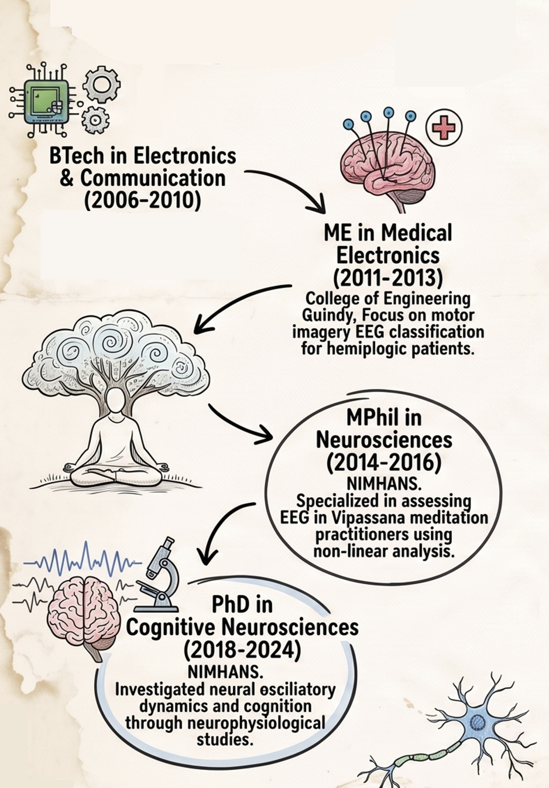

### From Circuits to Consciousness

Welcome to my journey so far from the world of electronics and communication
engineering to Consciousness research. 

I began my career designing logic on circuit boards, only to realise the most
complex operating system runs on wetware where there is no clear demarcation
of the data, hardware and software. I traded silicon for synapses, and
today, as a Cognitive Scientist at the Centre for Consciousness Studies (NIMHANS),
my work revolves around multiple states of Consciousness across illness and
wellness in waking, sleeping, tasking, meditating and dreaming brains.

I am establishing a research niche on "Sense of Self" exploring how it emerges,
fragments, and can be altered in various states like Schizophrenia, Autism, 
Depression, Lucid dreaming, altered states in meditation etc. This work integrates
neuroscience, psychiatry, technology, indian knowledge system based frameworks and contemplative science to understand 
the shifts of selfhood and their impact on mental health.

> Foundations

My professional journey began with a mediocre, boring technical education in a private
college where I did not learn anything! I took a break year post my BTech figuring out life.
It turned my world upside down and landed me in a decent institute for a masters. I would
say that I learned B Tech and M Tech together in 2 years! I loved working in the domain
of neurotechnology building brain computer interfaces for stroke patients. The research
focused on Brain-Computer Interface (BCI) applications for clinical rehabilitation,
specifically investigating the feasibility of using Motor Imagery (MI) based EEG features to
predict movement intentions in patients with hemiplegia. By collecting EEG data
during left versus right-hand motor imagery, the study demonstrated that 
imagery-related desynchronization from frontal sensors could reliably predict 
intended hand movement. I got into Accenture via campus placement with a good package and ended up
working on SAP software. That job sucked after 6 months! I locked myself in and cleared NIMHANS 
entrace exam and joined for an MPhil Neuroscience program. Resigned a month before, saw some movies, tried all
restaurants from one end of Marathahalli (an IT hub and infamous for traffic) to other!

> The Quiet Mind: Contemplative Science & Non-Linear Dynamics

During my MPhil research at NIMHANS and subsequent collaborations, I moved
beyond conventional EEG analysis to understand the "texture" of a meditating mind.
Standard analysis appraoches often misses the nuance of multiple meditative states in
[Vipassana meditation](https://www.sciencedirect.com/science/article/abs/pii/S0301051118301728).
I applied non-linear methods like `Permutation Entropy and Fractal Dimension` to high-density
EEG data to capture these inherent structures.

More recently, we deployed ML based approaches to understand how different 
meditation techniques are [Similar States but Different Paths](https://www.biorxiv.org/content/10.1101/2025.06.20.660652v1.abstract).
You can read the recent [paper](https://www.sciencedirect.com/science/article/pii/S0149763425005214#ab0015) from 
Matthew Sacchet's group if you are interested in this area of work.

> The Sleeping Brain: Stability, Spindles, and Sound

I was not sure of doing a PhD and decided to spent some more years in the same lab.
My time as a Junior Research Fellow at the Human Sleep Research Laboratory was
dedicated to understanding the micro-architecture of sleep in Vipassana meditators
and healthy controls. I conducted over 125 whole-night polysomnography (PSG) 
studies, using auditory stimulation and transcranial Alternating Current
Stimulation (tACS) to "shake" the sleep architecture and test its stability.
We identified that sleep ERPs and tACS-induced spectral changes could serve
as reliable markers for [sleep stability](https://onlinelibrary.wiley.com/doi/abs/10.1111/ner.12847).
More recently, we prototyped MVPA pipelines to decode dream states from sleep data using machine learning
classifiers.

We also explored how microstate dynamics shift during sleep in both 
healthy brains and those affected by Schizophrenia. I also supervised interns who 
developing machine learning classifiers to decode dream states from high-density
PSG data using serial awakening protocols. We also developed pipelines to capture sleep stage transitions and conceptualising sleep and awake across a continuum and deploying information theory and similar metrics to
characterise sleep better. Our centre also hosts advanced training in sleep research
with Indian Society for Sleep Research. You can read these two papers [1](https://www.cell.com/trends/neurosciences/fulltext/S0166-2236%2824%2900018-3#f0005)
[2](https://www.sciencedirect.com/science/article/pii/S0149763423004347) to
know more about the field.

Recent works (PhD projects) have moved to developing real time protocols to modulate
sleep spindles during sleep with oscillatory pink noise.

> Can we enhance our cognitive skills: Cognition & Neuromodulation

2018 and I joined for PhD bagging the institute felloship. By the way, I got married in 2017!
My PhD work focused on the "executive" of the brain: Working Memory.
I wanted to know if we could map its limits and push the capacity limits using transcranial
alternating current protocols. I designed a real-time adaptive working memory
paradigm paired with high-density EEG to study the brain at its optimal capacity
rather than at rest. Using tACS, I demonstrated that we could [differentially 
modulate](https://www.sciencedirect.com/science/article/pii/S1094715924006731) resting and task-related EEG data. By targeting specific frequencies (Theta and Gamma), we could influence the oscillatory
dynamics underlying working memory. A significant portion of this work involved studying patients with
Schizophrenia, using graph theory frameworks to identify specific profiles for targeted 
non-invasive neuromodulation.

> The Cardiac Signature: Heart Rate Variability (HRV) & Heart-Brain Interaction

We are exploring Heart-Brain interactions using computational models of brain-heart
interactions, and utilising robust and geometric versions of HRV analysis. We
applied [ultra short term heart rate variablity](https://www.sciencedirect.com/science/article/abs/pii/S0954611126000223) to understand OSA brains.

This is an active area of work at our centre. The goal is to model and understand
the three way interaction across nervous, cardiac and respiratory systems and how
does respiratory/cardiac/neural phases modulate/influence behavior and mental states.
I really got inspired by the works like [this](https://www.sciencedirect.com/science/article/pii/S0301051123001606),
and [this](https://www.sciencedirect.com/science/article/pii/S1053811922006632/).

Cross-Modal Modeling: The study "Unveiling the Heart-Brain Connection" explored
whether ECG signals could reliably reflect cognitive load. By extracting time-domain
HRV metrics and "Catch22" descriptors from ECG and spectral power from EEG, 
we built a cross-modal XGBoost framework. This framework projects ECG features
onto EEG-representative cognitive spaces, allowing mental workload inferences using only ECG.  

Synthetic Data Augmentation: To address data sparsity and model brain-heart interactions,
we integrated the Poincaré Sympathetic-Vagal Synthetic Data Generation (PSV-SDG) model.
This algorithm combines EEG and cardiac sympathetic-vagal dynamics to provide bidirectional
estimators of the mutual interplay between the central and autonomic nervous systems.

Further multimodal inquiry has investigated pupillometry as a non-invasive indicator of cognitive effort.
Using the OpenNeuro dataset, we integrated feature-based and model-driven approaches
to classify cognitive load from EEG and pupillometry.

The above three works were MTech dissertation works with mentees. Glad that, they landed jobs in AI post this.

> Teaching and Mentoring: Building the Lab

Science is rarely a solo endeavor. I have had the privilege of mentoring over
25 trainees and interns at NIMHANS, guiding them from modularised project ideas
to full execution. Our collaborative projects have explored inter-brain synchrony
during musical engagement , Heart Evoked Potentials across sleep stages, and 
the association between personality traits and executive control in school children.
I collaborated with a bunch of hardware and software engineers to extend wireless
wearable EEG devices with single-board computers for real-time neurofeedback and
seizure prediction.

### What's happening now?

a) Phase 1 of predicting brain age index (chronological age minus brain age) from
EEG is completed. Siddharth and Deepshik was heading this work and we publsihed
the [preprint](https://www.biorxiv.org/content/10.64898/2026.08.04.742735v1).
An ex-intern would extend this work to predict cognitive scores from EEG (December 2026 onwards)

b) By understanding how the brain responds to the heart's rhythmic signals,
we can unlock new insights into interoception, cognitive load, and consciousness.
Does the Heart Race with the Mind when we do a tough mental task? The brain doesn't
stop listening to the heart when we fall asleep. How do sleep stages modulate
these HEPs? Can we track meditative depth with HEPs? What is being captured by HEPs? Lot more in this direction
We did a detailed literature survey on this and an intern is gearing up to pick 
this up for her master's dissertation.

c) I am back to where it all began - BCI work in stroke. I am exploring imagined speech
tracking with Dr. Subasree's team at Stroke lab, Dept. of Neurology, NIMHANS.